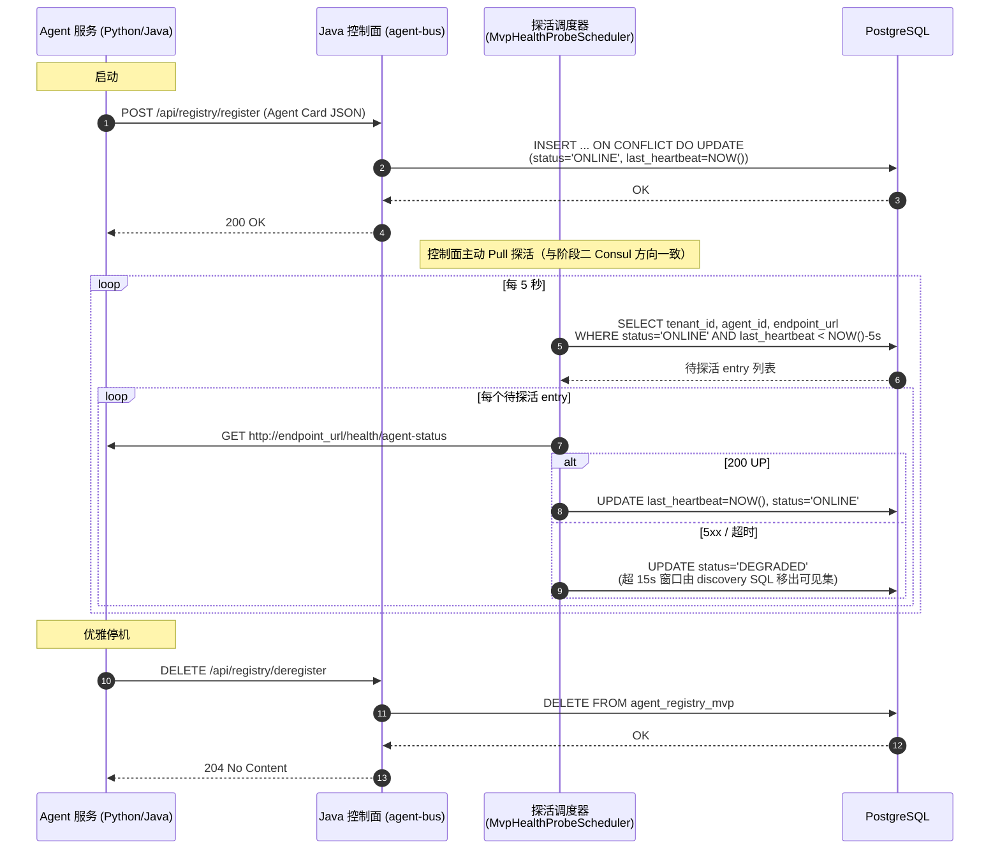
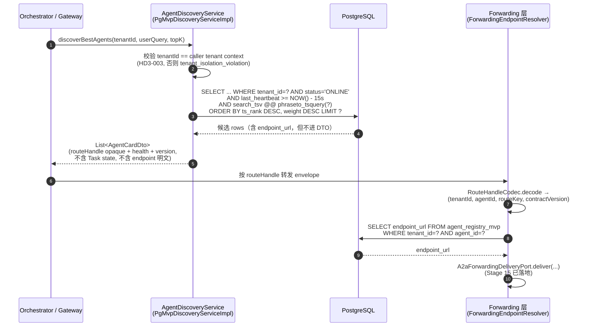
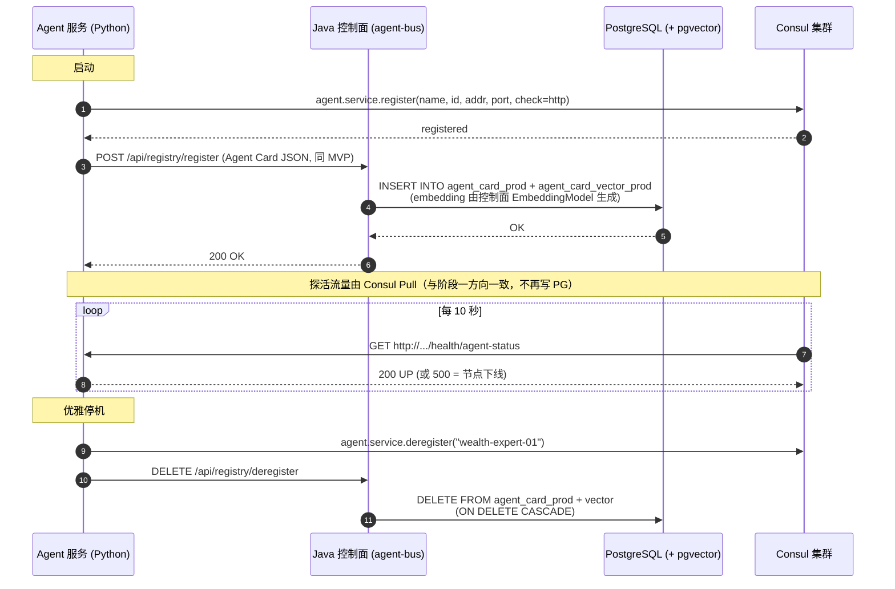
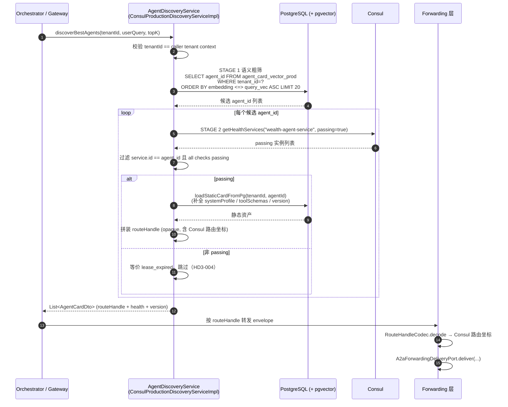

# Agent Registry / Discovery 运行态技术设计（MVP → 生产两阶段）

> 本文档为 `agent-bus` AB-F12（Agent Registry / Discovery）的运行态实施技术设计。Stage 3 仅定义了接口语义与 harness 断言，**durable / memory / 外部 discovery 系统的选择 deferred**（HD3-007）。本文给出可落地的两阶段实施方案：阶段一纯 PostgreSQL + SQL 检索跑通 MVP 原型，阶段二引入 Consul + PGVector 演进到生产形态，迁移过程对 Agent 服务侧业务零重构、对上层 Orchestrator 零改动。
>
> **术语对齐 L0**：本文档中的「Agent 服务」指通过 `agent-runtime` SPI 适配接入 `agent-bus` 的异构智能体服务实例（Python / Java / 自研框架），即 ICD 中注册的「routable capability」承载方。L0 顶层模块中不存在「Sub-Agent」逻辑模块，故本文档统一使用「Agent 服务」表述。

## 1. 背景与目标

### 1.1 问题上下文

`ICD-Agent-Registry-Discovery` 已固化以下不变量（本文不重开）：

- `agent-bus` **只拥有 runtime route index / discovery view**（HD3-001），不拥有 agent 业务定义、不拥有 Task lifecycle / execution state。
- registry key = `(tenantId, agentId|serviceId, capability)`，`tenantId` 强制（HD3-003），跨 tenant 查询显式失败 `tenant_isolation_violation`，**禁止跨 tenant fallback**。
- discovery 返回 **opaque route handle**（HD3-006），内部封装 endpoint / topic / serviceId / routeKey，调用方不直接操作物理 endpoint。
- lease / TTL 到期即从可见集移除（`lease_expired`，HD3-004）；`health` 为 optional metadata，unhealthy target 仍可见但必须显式标注。
- 每个 entry 携带 `contractVersion` / `capabilityVersion`（HD3-005），version mismatch 显式 `version_unavailable`。

Stage 3 把「memory / durable / 外部 discovery 系统」的选择留到后续波次。本文补齐这一裁口，给出两阶段落地方案。

### 1.2 设计目标

| 目标 | 衡量标准 |
|---|---|
| **快速跑通 MVP** | 阶段一不引入 Consul、不引入 PGVector，单 PostgreSQL 实例即可驱动注册 / 探活 / 发现全链。 |
| **Agent 服务侧零重构迁移** | 阶段一 → 阶段二迁移时，Agent 服务业务代码（接收自然语言、执行工具）零改动，仅调整启动注册逻辑。 |
| **心跳模式两阶段一致** | 两阶段均采用「注册中心主动 Pull 探活」模式；阶段二迁移不涉及心跳方向反转，仅替换探活执行方（控制面调度器 → Consul agent）。 |
| **控制面平滑过渡** | 上层 Orchestrator 依赖 `AgentDiscoveryService` 接口寻址，阶段切换通过 `@Primary` 注入切换实现类，**零代码改动**。 |
| **不破 ICD 边界** | 两阶段实现都遵守 HD3-001..007；route handle opaque、tenant 隔离、不持有 Task state、不跨 tenant fallback。 |
| **契约层稳定** | Agent 服务启动时提交的 Standard Agent Card JSON 在两阶段**结构完全一致**，仅扩展字段不破坏旧字段。 |

### 1.3 阶段划分总览

| 维度 | 阶段一：MVP 原型期 | 阶段二：生产演进期 |
|---|---|---|
| 基础设施 | 单 PostgreSQL（无 PGVector 扩展） | PostgreSQL（+ pgvector 扩展）+ 独立 Consul 集群 |
| Agent 检索方式 | **SQL 全文检索**（tsvector + GIN 索引，加权排名） | **向量语义检索**（pgvector `<=>` L2 距离） |
| 心跳流量方向 | Java 控制面 ──► Agent 服务（Pull，5s 探活间隔） | Consul ──► Agent 服务（Pull，10s 探活间隔） |
| 健康状态归属 | PG 表 `status` / `last_heartbeat` 字段（控制面调度器写入） | Consul `passing` 状态 |
| 控制面心跳接口 | 无（探活由控制面调度器内部发起，不对外暴露 HTTP 接口） | 无（Consul agent 探活） |
| Orchestrator 改动 | 无（注入 `PgMvpDiscoveryServiceImpl`） | 无（注入 `ConsulProductionDiscoveryServiceImpl`） |
| Agent 服务业务改动 | 无 | 无 |

## 2. 契约层设计（两阶段共用）

契约层是平滑迁移的根。无论阶段一还是阶段二，Agent 服务（Python / Java / 异构框架经 `agent-runtime` SPI 适配）启动时向控制面提交结构完全一致的 **Standard Agent Card**，控制面对外暴露同一个 `AgentDiscoveryService` 接口。

### 2.1 Standard Agent Card 报文

Agent 服务启动时通过 HTTP `POST /api/registry/register` 提交（字段对齐 `ICD-Agent-Registry-Discovery` 的 Registry Entry Required / Optional Fields）：

```json
{
  "tenantId": "tenant-wealth-01",
  "agentId": "wealth-expert-01",
  "serviceId": "wealth-agent-service",
  "agentName": "理财专家智能体",
  "agentType": "BUY_WEALTH",
  "capability": "wealth.purchase",
  "capabilityKeywords": "申购理财, 风险评估, 稳健型理财, 基金筛选",
  "systemProfile": "我能够理解用户的理财意图并筛选匹配的理财产品。",
  "routeKey": "wealth/v1",
  "contractVersion": "1",
  "capabilityVersion": "1.0.0",
  "endpointUrl": "http://192.168.1.50:8000",
  "maxConcurrency": 10,
  "weight": 100,
  "region": "cn-east-1",
  "toolSchemas": [
    {
      "name": "buy_fund",
      "description": "根据基金代码和金额进行申购",
      "parameters": {
        "type": "object",
        "properties": {
          "fund_code": {"type": "string", "description": "基金六位代码"},
          "amount": {"type": "number", "description": "申购金额"}
        },
        "required": ["fund_code", "amount"]
      }
    }
  ]
}
```

字段映射 ICD：

| Agent Card 字段 | ICD Registry Entry 字段 | 必填 | 说明 |
|---|---|---|---|
| `tenantId` | `tenantId` | 是 | registry key 强制维度；跨 tenant fallback 禁止。 |
| `agentId` / `serviceId` | `agentId` / `serviceId` | 是 | registry key 组成；`serviceId` 用于 Consul 服务聚合。 |
| `capability` | `capability` | 是 | registry key 组成；discover query 强制维度。 |
| `routeKey` | `routeKey` | 是 | 逻辑路由键，封装进 route handle。 |
| `contractVersion` / `capabilityVersion` | `contractVersion` / `capabilityVersion` | 是 | HD3-005 version 约束。 |
| `endpointUrl` | `endpoint` / `routeTarget` | 是 | 逻辑目标；不直接暴露给 discover 调用方，封装进 route handle。 |
| `capabilityKeywords` / `systemProfile` | （检索索引源） | 是 | 阶段一 tsvector 源 / 阶段二 embedding 源。 |
| `maxConcurrency` / `weight` / `region` | `weight` / `region` / `deploymentVariant` | 否 | selectionHint。 |
| `toolSchemas` | （扩展） | 否 | agent 能力 schema，不影响路由索引。 |

> 阶段一 → 阶段二迁移时，Agent Card **不删字段、不改语义**，仅可能在阶段二追加 `embeddingModel` / `vectorDim` 等可选元数据字段。Agent 服务提交方无感知。

### 2.2 AgentDiscoveryService 接口（控制面寻址契约）

```java
package com.huawei.ascend.bus.spi.registry;

import java.util.List;

/**
 * agent-bus 拥有的 runtime route index 检索入口（HD3-001）。
 * 上层 Orchestrator / Gateway 仅依赖此接口，不感知持久化形态。
 *
 * 实现类：
 *   - 阶段一：PgMvpDiscoveryServiceImpl（@Primary，纯 PostgreSQL + SQL 检索）
 *   - 阶段二：ConsulProductionDiscoveryServiceImpl（@Primary，PGVector + Consul）
 */
public interface AgentDiscoveryService {

    /**
     * 在 tenant 作用域内，按自然语言意图检索最匹配的候选 agent。
     *
     * @param tenantId  强制 tenant 维度；与 caller tenant context 不一致时抛 tenant_isolation_violation
     * @param userQuery 自然语言意图（阶段一做关键词分词检索，阶段二做向量检索）
     * @param topK      返回候选数上限
     * @return opaque route handle + health + version；不携带 Task execution state（HD3-006）
     */
    List<AgentCardDto> discoverBestAgents(String tenantId, String userQuery, int topK);
}
```

`AgentCardDto` 对外只暴露 routing 视图（不含物理 endpoint 明文，调用方拿到的是 `routeHandle` + health + version + selectionHint），对齐 HD3-006「discovery result 不得携带 Task execution state」与「调用方不直接操作物理 endpoint」。

## 3. 阶段一：MVP 原型期（纯 PostgreSQL + SQL 检索）

### 3.1 核心思路

不引入 Consul、不引入 PGVector 扩展。用一张 PostgreSQL 表同时承载「静态资产」与「简易健康状态」，用 `tsvector` + GIN 索引做基于关键词的 SQL 检索。Agent 服务启动时 Push 一次注册（提交 Agent Card），之后由**控制面调度器周期 Pull 探活** Agent 服务的 `/health/agent-status` 端点，把探活结果回写 PG 的 `status` / `last_heartbeat` 字段。该模式与阶段二 Consul 的 Pull 探活方向一致，迁移时无需反转心跳流向。

> 与样例的差异：样例 MVP 即用 PGVector，且样例采用 Agent 服务 Push 心跳。本设计按需求把 MVP 检索降级为纯 SQL（tsvector 全文检索），并把心跳改为注册中心主动 Pull 探活——既避免 MVP 阶段引入 pgvector 扩展依赖，又使两阶段心跳模式统一，降低迁移摩擦。

### 3.2 数据库表结构

```sql
-- 1. 物理状态与静态资产合一表（MVP）
CREATE TABLE agent_registry_mvp (
    tenant_id            VARCHAR(64)  NOT NULL,
    agent_id             VARCHAR(64)  NOT NULL,
    service_id           VARCHAR(64)  NOT NULL,
    agent_name           VARCHAR(128) NOT NULL,
    agent_type           VARCHAR(32)  NOT NULL,
    capability           VARCHAR(64)  NOT NULL,
    capability_keywords  TEXT,
    system_profile       TEXT         NOT NULL,
    route_key            VARCHAR(64)  NOT NULL,
    contract_version     VARCHAR(16)  NOT NULL,
    capability_version   VARCHAR(16)  NOT NULL,
    endpoint_url         VARCHAR(256) NOT NULL,
    max_concurrency      INT          DEFAULT 10,
    weight               INT          DEFAULT 100,
    region               VARCHAR(32),
    tool_schemas         JSONB,
    -- MVP 平替 Consul 的健康状态字段
    status               VARCHAR(16)  DEFAULT 'ONLINE',
    last_heartbeat       TIMESTAMPTZ  DEFAULT CURRENT_TIMESTAMP,
    -- 全文检索向量（capability_keywords + system_profile 加权合成）
    search_tsv           TSVECTOR
    GENERATED ALWAYS AS (
        setweight(to_tsvector('simple', coalesce(capability_keywords, '')), 'A') ||
        setweight(to_tsvector('simple', coalesce(system_profile,      '')), 'B')
    ) STORED,
    PRIMARY KEY (tenant_id, agent_id),
    CHECK (status IN ('ONLINE', 'DEGRADED', 'DRAINING', 'OFFLINE'))
);

-- 2. 检索索引：GIN 全文索引（tenant + capability 过滤 + tsvector 排名）
CREATE INDEX idx_agent_registry_mvp_search
    ON agent_registry_mvp
    USING GIN (tenant_id, capability, search_tsv);

-- 3. 心跳过期清理索引（lease 窗口扫描）
CREATE INDEX idx_agent_registry_mvp_heartbeat
    ON agent_registry_mvp (last_heartbeat)
    WHERE status = 'ONLINE';
```

> `tenant_id` + `agent_id` 联合主键固化 HD3-003「registry key 必须包含 tenantId」。`search_tsv` 用 `GENERATED ALWAYS` 列保证检索向量与正文一致，避免应用层同步漂移。

### 3.2.1 Flyway migration 归属

migration 文件落在 `agent-bus/src/main/resources/db/migration/V2__create_agent_registry_mvp.sql`（与现有 `V1__create_agent_bus_forwarding_outbox_inbox.sql` 同目录）。`agent-bus` 的 `module-metadata.yaml` 已允许 `spring-boot-starter-jdbc` + `flyway-core` + `flyway-database-postgresql` + `org.postgresql:postgresql`，**无需新增依赖**（Stage 12 已打破路径 B）。

### 3.3 控制面实现

#### 3.3.1 检索实现 `PgMvpDiscoveryServiceImpl`

```java
package com.huawei.ascend.bus.registry.runtime.discovery;

import com.huawei.ascend.bus.spi.registry.AgentCardDto;
import com.huawei.ascend.bus.spi.registry.AgentDiscoveryService;
import lombok.RequiredArgsConstructor;
import org.springframework.jdbc.core.JdbcTemplate;
import org.springframework.stereotype.Service;
import org.springframework.context.annotation.Primary;

import java.util.List;

@Service
@Primary                       // 原型期优先注入此实现
@RequiredArgsConstructor
public class PgMvpDiscoveryServiceImpl implements AgentDiscoveryService {

    private final JdbcTemplate jdbcTemplate;
    private final TenantContext tenantContext;   // 调用方 tenant 上下文

    @Override
    public List<AgentCardDto> discoverBestAgents(String tenantId, String userQuery, int topK) {
        // HD3-003：调用方 tenant 上下文必须与 query tenantId 一致
        if (!tenantId.equals(tenantContext.current())) {
            throw new TenantIsolationViolationException(tenantId, tenantContext.current());
        }

        // 两阶段合成一条 SQL：ts_rank 加权排名 + 15s 探活可见性窗口硬过滤 + tenant/capability 过滤
        String sql = """
            SELECT agent_id, service_id, agent_name, capability, route_key,
                   contract_version, capability_version, system_profile,
                   tool_schemas, weight, region, status,
                   ts_rank(search_tsv, phraseto_tsquery('simple', ?)) AS rank
            FROM agent_registry_mvp
            WHERE tenant_id = ?
              AND status = 'ONLINE'
              AND last_heartbeat >= NOW() - INTERVAL '15 seconds'
              AND search_tsv @@ phraseto_tsquery('simple', ?)
            ORDER BY rank DESC, weight DESC
            LIMIT ?
            """;

        return jdbcTemplate.query(sql,
            (rs, rowNum) -> AgentCardDto.builder()
                .tenantId(tenantId)
                .agentId(rs.getString("agent_id"))
                .serviceId(rs.getString("service_id"))
                .agentName(rs.getString("agent_name"))
                .capability(rs.getString("capability"))
                .routeKey(rs.getString("route_key"))
                .contractVersion(rs.getString("contract_version"))
                .capabilityVersion(rs.getString("capability_version"))
                .systemProfile(rs.getString("system_profile"))
                .toolSchemas(rs.getString("tool_schemas"))
                .weight(rs.getInt("weight"))
                .region(rs.getString("region"))
                .health(rs.getString("status"))
                // routeHandle 是 opaque 引用，封装 (tenantId, agentId, routeKey, contractVersion)
                // 调用方不直接拿到 endpoint_url 明文
                .routeHandle(RouteHandleCodec.encode(tenantId, rs.getString("agent_id"),
                                                     rs.getString("route_key"),
                                                     rs.getString("contract_version")))
                .build(),
            userQuery, tenantId, userQuery, topK);
    }
}
```

> `endpoint_url` 不进入 `AgentCardDto`——对齐 HD3-006「调用方不直接操作物理 endpoint」。物理 endpoint 的解析由 forwarding 层（`ForwardingEndpointResolver`，Stage 15 已留端口）消费 route handle 完成，与 `ICD-Agent-Bus-Forwarding` 一致。

#### 3.3.2 注册控制器 `MvpRegistryController` 与探活调度器 `MvpHealthProbeScheduler`

```java
package com.huawei.ascend.bus.registry.runtime.api;

import lombok.RequiredArgsConstructor;
import org.springframework.http.ResponseEntity;
import org.springframework.jdbc.core.JdbcTemplate;
import org.springframework.web.bind.annotation.*;

@RestController
@RequestMapping("/api/registry")
@RequiredArgsConstructor
public class MvpRegistryController {

    private final JdbcTemplate jdbcTemplate;

    @PostMapping("/register")
    public ResponseEntity<Void> register(@RequestBody AgentCard card) {
        // upsert：agent 重启后覆盖旧 entry
        jdbcTemplate.update("""
            INSERT INTO agent_registry_mvp
                (tenant_id, agent_id, service_id, agent_name, agent_type, capability,
                 capability_keywords, system_profile, route_key, contract_version,
                 capability_version, endpoint_url, max_concurrency, weight, region,
                 tool_schemas, status, last_heartbeat)
            VALUES (?,?,?,?,?,?,?,?,?,?,?,?,?,?,?,?, 'ONLINE', CURRENT_TIMESTAMP)
            ON CONFLICT (tenant_id, agent_id) DO UPDATE SET
                service_id=EXCLUDED.service_id, agent_name=EXCLUDED.agent_name,
                capability=EXCLUDED.capability, capability_keywords=EXCLUDED.capability_keywords,
                system_profile=EXCLUDED.system_profile, route_key=EXCLUDED.route_key,
                contract_version=EXCLUDED.contract_version,
                capability_version=EXCLUDED.capability_version,
                endpoint_url=EXCLUDED.endpoint_url, max_concurrency=EXCLUDED.max_concurrency,
                weight=EXCLUDED.weight, region=EXCLUDED.region,
                tool_schemas=EXCLUDED.tool_schemas,
                status='ONLINE', last_heartbeat=CURRENT_TIMESTAMP
            """,
            card.getTenantId(), card.getAgentId(), card.getServiceId(), /* ... */);
        return ResponseEntity.ok().build();
    }

    @DeleteMapping("/deregister")
    public ResponseEntity<Void> deregister(@RequestParam String tenantId,
                                           @RequestParam String agentId) {
        jdbcTemplate.update(
            "DELETE FROM agent_registry_mvp WHERE tenant_id = ? AND agent_id = ?",
            tenantId, agentId);
        return ResponseEntity.noContent().build();
    }
}
```

> 不再提供 `PUT /api/registry/heartbeat`：阶段一即采用注册中心主动 Pull 探活，Agent 服务无需实现心跳 Push 逻辑，契约面更窄。Agent 服务只需暴露一个 HTTP `GET /health/agent-status` 端点供控制面探活（与阶段二 Consul 探活端点共用，迁移零改动）。

```java
package com.huawei.ascend.bus.registry.runtime.health;

import lombok.RequiredArgsConstructor;
import lombok.extern.slf4j.Slf4j;
import org.springframework.jdbc.core.JdbcTemplate;
import org.springframework.scheduling.annotation.Scheduled;
import org.springframework.stereotype.Component;
import org.springframework.web.client.RestClient;

import java.util.List;
import java.util.Map;

/**
 * 阶段一注册中心主动 Pull 探活调度器。
 * 周期扫描 ONLINE entry，HTTP 探活 endpoint_url + '/health/agent-status'，
 * 把探活结果回写 PG 的 status / last_heartbeat 字段。
 *
 * 与阶段二 Consul agent 的 Pull 探活方向一致，迁移时仅需把探活执行方
 * 从「控制面调度器」替换为「Consul agent」，PG 不再承载心跳写流量。
 */
@Component
@RequiredArgsConstructor
@Slf4j
public class MvpHealthProbeScheduler {

    private final JdbcTemplate jdbcTemplate;
    private final RestClient httpClient = RestClient.create();

    @Scheduled(fixedDelayString = "${agent-bus.registry.mvp.probe-interval-ms:5000}")
    public void probeOnlineAgents() {
        List<Map<String, Object>> rows = jdbcTemplate.queryForList("""
            SELECT tenant_id, agent_id, endpoint_url
            FROM agent_registry_mvp
            WHERE status = 'ONLINE'
              AND last_heartbeat < NOW() - INTERVAL '5 seconds'
            LIMIT 200
            """);

        for (Map<String, Object> row : rows) {
            String tenantId = (String) row.get("tenant_id");
            String agentId  = (String) row.get("agent_id");
            String url      = row.get("endpoint_url") + "/health/agent-status";
            try {
                httpClient.get().uri(url).retrieve().toBodilessEntity();
                jdbcTemplate.update("""
                    UPDATE agent_registry_mvp
                    SET last_heartbeat = CURRENT_TIMESTAMP, status = 'ONLINE'
                    WHERE tenant_id = ? AND agent_id = ?
                    """, tenantId, agentId);
            } catch (Exception ex) {
                // 探活失败：标记 DEGRADED；超 15s 窗口由 discovery SQL 硬过滤移出可见集
                jdbcTemplate.update("""
                    UPDATE agent_registry_mvp
                    SET status = 'DEGRADED'
                    WHERE tenant_id = ? AND agent_id = ?
                    """, tenantId, agentId);
            }
        }
    }
}
```

### 3.4 调用流程图（MVP）

#### 3.4.1 注册与探活流程



#### 3.4.2 Discovery 寻址流程



> route handle 的 opaque 解封发生在 forwarding 层（`ForwardingEndpointResolver`，Stage 15 默认 `MapEndpointResolver`，生产由本设计的 registry 替换），与 `ICD-Agent-Bus-Forwarding` 「envelope 通过 `routeHandle` 消费 Stage 3 discovery result，不直接暴露物理 endpoint」一致。

### 3.5 实施偏离回更（step-7 reconcile）

> 本节由 step-7 reconcile 在 W4 收尾时回更，登记 §3.2 / §3.3.1 / §3.3.2 / §9.2 / §11 原始设计与 S1-S5 落地实现之间的 9 项偏离。每项给出：原设计位置、实施偏离、落地文件、原因。原始设计代码块保留作为设计意图记录，下方代码块以 ⚠️ 标注的为准。

| # | 原设计（§） | 实施偏离 | 落地文件 | 原因 |
|---|---|---|---|---|
| D-1 | §3.3.1 `PgMvpDiscoveryServiceImpl` 直接注入 `JdbcTemplate` | 改为 port/adapter：注入 `AgentRegistryRepository` port，调 `searchByIntent` / `searchByCapability` / `findEndpoint` | `agent-bus/src/main/java/com/huawei/ascend/bus/registry/runtime/discovery/PgMvpDiscoveryServiceImpl.java` + `persistence/jdbc/AgentRegistryRepository.java` | ADR-0160 决策 4 — JDBC 限 `persistence.jdbc` 子包；discovery 层不得直接 import `java.sql` / `JdbcTemplate`。`AgentBusRegistryJdbcPurityTest` 守卫 |
| D-2 | §3.3.1 discovery SQL `WHERE status = 'ONLINE'` | 放宽为 `WHERE status IN ('ONLINE','DEGRADED')` | `AgentRegistryRepository.searchByIntent` / `searchByCapability`（V2 migration 注释明示） | HD3-004 — DEGRADED 仍可见但 health 字段显式标注；探活失败标 DEGRADED 不立即移出可见集，超 15s 窗口才移除 |
| D-3 | §3.3.2 `RouteHandleCodec` 被 forwarding 层直接调用 | 改为 `AgentDiscoveryService.resolveRouteHandle(routeHandle, tenantId)` SPI 方法；`RouteHandleCodec` 降为 `registry.runtime.discovery` 包内部工具类 | `spi/registry/AgentDiscoveryService.java`（resolveRouteHandle 方法） + `runtime/discovery/RouteHandleCodec.java`（package-private） | ADR-0160 决策 5 — route handle 解封是 SPI 契约，forwarding 层依赖 SPI 不依赖 codec 实现；codec 格式可演进（`v1:` 前缀）不破跨模块消费方 |
| D-4 | §3.3.2 `MvpRegistryController` / `MvpHealthProbeScheduler` 直接注入 `JdbcTemplate` | 改为调 `AgentRegistryRepository` port：controller 调 `upsert` / `delete`，scheduler 调 `scanDueForProbe` / `updateStatus` | `runtime/api/MvpRegistryController.java` + `runtime/health/MvpHealthProbeScheduler.java` | 同 D-1，ADR-0160 决策 4 — `api` / `health` 子包禁 JDBC import |
| D-5 | §11 `@EnableScheduling` 落 `agent-bus` 主类 | 改为独立 `RegistrySchedulingConfig @Configuration`（KF-1） | `runtime/RegistrySchedulingConfig.java` | KF-1 — `agent-bus` 是 library jar，无 `@SpringBootApplication` 主类；独立 `@Configuration` 由 runtime consumer（`agent-runtime` `LocalA2aRuntimeHost`）component scan 拾取 |
| D-6 | §3.2 GIN 索引 `USING GIN (tenant_id, capability, search_tsv)` | 拆分为 `GIN(search_tsv)` + `BTREE(tenant_id, capability)` 两个索引 | `V2__create_agent_registry_mvp.sql`（`idx_agent_registry_mvp_search_tsv` + `idx_agent_registry_mvp_tenant_capability`） | PostgreSQL GIN 无 varchar 默认 operator class；planner 通过 BitmapAnd 合并两个索引 |
| D-7 | §3.3.2 `TenantFilter` + `TenantFilterRegistration` 拦截器 populate `TenantContext` | 弃用 `TenantFilter`；改用三层隔离：(1) 应用层 `WHERE tenant_id=?` 显式参数 (2) PG RLS policy `agent_registry_mvp_tenant_isolation` (3) `ThreadLocalTenantContext.bindForScope` 为后台调度路径设置 `app.tenant_id` session var | `runtime/tenant/ThreadLocalTenantContext.java` + `V2__create_agent_registry_mvp.sql`（RLS policy） + 所有 Repository 方法 tenantId 显式参数 | ESC-2 design pivot — Servlet filter 在 library jar 不可靠（KF-1 同因），且 RLS 提供纵深防御；ADR-0160 决策 6 |
| D-8 | §9.2 audit 11 字段 + micrometer 直接散落 controller/scheduler | 集中到 `RegistryObservabilityConfig` 单文件 facade：SLF4J `registry.audit` logger（11 字段结构化日志）+ Micrometer `Counter` / `Timer`（op + outcome 标签） | `runtime/RegistryObservabilityConfig.java` | 单文件 facade 避免 audit-without-metric 漂移；`micrometer-core` provided scope 由 runtime consumer 提供；ADR-0160 决策 7 |
| D-9 | §3.3.2 controller/scheduler 直接 `new RestClient()` | controller/scheduler 注入共享 `RestClient` bean（由 `RegistryObservabilityConfig` 或 Spring Boot autoconfig 提供） | `runtime/api/MvpRegistryController.java` + `runtime/health/MvpHealthProbeScheduler.java` | 共享 bean 便于统一连接池/超时配置；与 §9.2 可观测性挂钩 |

> **ADR-0160 决策 6/7 联动**：D-7（tenant 隔离三层）+ D-8（micrometer-core provided scope）+ `agent-bus/pom.xml` 加 `spring-boot-starter-web (provided)` 是 ESC-2(b) 选项 B 边界演进的三件套，已落地并经 `AgentBusRegistryJdbcPurityTest` 守卫。H2/H3 阶段进入 Consul 引入时再统一审核跨边界影响（用户裁决：step-7 接受现状）。

> **`module-metadata.yaml allowed_dependencies` 同步**：`spring-boot-starter-web` + `micrometer-core` 已在 `agent-bus/module-metadata.yaml` 声明（provided scope），`forbidden_dependencies` 维持不变。

## 4. 阶段二：生产演进期（Consul + PGVector）

### 4.1 核心思路

引入独立 Consul 集群承担高频健康探活（仍是 Pull 模式，与阶段一方向一致），把探活写流量从 PG 剥离到 Consul。PG 启用 pgvector 扩展，把检索从关键词 tsvector 升级为向量语义检索。阶段一的控制面 `MvpHealthProbeScheduler` 退场，由 Consul agent 取代探活执行方；`AgentDiscoveryService` 实现类通过 `@Primary` 切换。Agent 服务的 `/health/agent-status` 端点无需任何改动——阶段一供控制面调度器探活，阶段二供 Consul agent 探活，URL 与返回契约完全一致。

### 4.2 物理拓扑与表重构

PG 删除 `status` / `last_heartbeat` 字段，降维为「静态资产 + 语义索引黄页」：

```sql
-- 1. 静态资产表（生产）
CREATE TABLE agent_card_prod (
    tenant_id            VARCHAR(64)  NOT NULL,
    agent_id             VARCHAR(64)  NOT NULL,
    service_id           VARCHAR(64)  NOT NULL,
    agent_name           VARCHAR(128) NOT NULL,
    agent_type           VARCHAR(32)  NOT NULL,
    capability           VARCHAR(64)  NOT NULL,
    capability_keywords  TEXT,
    system_profile       TEXT         NOT NULL,
    route_key            VARCHAR(64)  NOT NULL,
    contract_version     VARCHAR(16)  NOT NULL,
    capability_version   VARCHAR(16)  NOT NULL,
    endpoint_url         VARCHAR(256) NOT NULL,
    max_concurrency      INT          DEFAULT 10,
    weight               INT          DEFAULT 100,
    region               VARCHAR(32),
    tool_schemas         JSONB,
    PRIMARY KEY (tenant_id, agent_id)
);

-- 2. 语义能力向量表（生产）
CREATE EXTENSION IF NOT EXISTS vector;  -- pgvector

CREATE TABLE agent_card_vector_prod (
    id          UUID PRIMARY KEY DEFAULT gen_random_uuid(),
    tenant_id   VARCHAR(64) NOT NULL,
    agent_id    VARCHAR(64) NOT NULL
        REFERENCES agent_card_prod(tenant_id, agent_id) ON DELETE CASCADE,
    content     TEXT,
    embedding   VECTOR(1536)   -- 对齐 Spring AI 默认 Embedding 维度
);

CREATE INDEX idx_agent_card_vector_prod_search
    ON agent_card_vector_prod
    USING ivfflat (embedding vector_cosine_ops)
    WITH (lists = 100);

CREATE INDEX idx_agent_card_vector_prod_tenant
    ON agent_card_vector_prod (tenant_id, agent_id);
```

> `agent_card_prod` 的联合主键 `(tenant_id, agent_id)` 与 MVP 表对齐，迁移时可直接 `INSERT INTO ... SELECT ...`。`status` / `last_heartbeat` 字段不迁移——生产期可见性由 Consul 决定。

### 4.3 Agent 服务侧改造（Python 示例）

Agent 服务**无需删除任何心跳定时器**（阶段一本就没有），仅在启动时追加 Consul 注册。`/health/agent-status` 端点在阶段一已存在（供控制面调度器探活），阶段二直接复用（供 Consul agent 探活），URL 与响应契约完全一致。业务代码（接收自然语言、执行工具）零改动。

```python
import consul
import requests
from fastapi import FastAPI, Response, status

app = FastAPI()

@app.on_event("startup")
def prod_register():
    # 1. 物理层注册至外部 Consul（阶段二新增；探活端点复用阶段一已有端点）
    c = consul.Consul(host="192.168.1.100", port=8500)
    c.agent.service.register(
        name="wealth-agent-service",
        service_id="wealth-expert-01",
        address="192.168.1.50",
        port=8000,
        # Consul Pull 模式：10s 探活，5s 超时，500/超时即判节点下线
        check=consul.Check.http(
            url="http://192.168.1.50:8000/health/agent-status",
            interval="10s", timeout="5s"
        )
    )
    # 2. 语义资产同步至 Java 控制面（接口契约与阶段一完全兼容）
    requests.post(
        "http://192.168.1.101:8080/api/registry/register",
        json={...}   # 与 MVP 阶段一致的 Agent Card JSON
    )

@app.get("/health/agent-status")
def health_check():
    # 阶段一供控制面 MvpHealthProbeScheduler 探活；
    # 阶段二供 Consul agent 探活。端点 URL 与响应契约两阶段一致。
    # 可在此处挂载本地大模型 / 昇腾 NPU / vllm 的状态探活
    if not check_npu_and_vllm_alive():
        return Response(status_code=status.HTTP_500_INTERNAL_SERVER_ERROR)
    return {"status": "UP"}
```

> Agent 服务业务循环（自然语言处理、工具执行）在这两阶段之间**没有任何改动**——这是「Agent 服务侧零重构」的具体含义。

### 4.4 控制面检索实现 `ConsulProductionDiscoveryServiceImpl`

引入 `spring-cloud-starter-consul-discovery` 依赖。新实现类替换 `@Primary`，上层 Orchestrator 零改动迁移。

```java
package com.huawei.ascend.bus.registry.runtime.discovery;

import com.huawei.ascend.bus.spi.registry.AgentCardDto;
import com.huawei.ascend.bus.spi.registry.AgentDiscoveryService;
import com.ecwid.consul.v1.ConsulClient;
import com.ecwid.consul.v1.Response;
import com.ecwid.consul.v1.health.model.HealthService;
import lombok.RequiredArgsConstructor;
import lombok.extern.slf4j.Slf4j;
import org.springframework.context.annotation.Primary;
import org.springframework.jdbc.core.JdbcTemplate;
import org.springframework.stereotype.Service;

import java.util.*;

@Service
@Primary                       // 切换：生产期优先注入此实现，PgMvpDiscoveryServiceImpl 退场
@RequiredArgsConstructor
@Slf4j
public class ConsulProductionDiscoveryServiceImpl implements AgentDiscoveryService {

    private final JdbcTemplate jdbcTemplate;
    private final ConsulClient consulClient;
    private final TenantContext tenantContext;

    @Override
    public List<AgentCardDto> discoverBestAgents(String tenantId, String userQuery, int topK) {
        if (!tenantId.equals(tenantContext.current())) {
            throw new TenantIsolationViolationException(tenantId, tenantContext.current());
        }

        // ---- STAGE 1：PGVector 语义粗筛（PostgreSQL）----
        float[] queryEmbedding = embeddingModel.embed(userQuery);
        String vectorStr = pgVectorToString(queryEmbedding);

        List<String> candidateAgentIds = jdbcTemplate.query("""
            SELECT v.agent_id
            FROM agent_card_vector_prod v
            JOIN agent_card_prod r
              ON v.tenant_id = r.tenant_id AND v.agent_id = r.agent_id
            WHERE v.tenant_id = ?
            ORDER BY v.embedding <=> ?::vector ASC
            LIMIT 20
            """,
            (rs, rowNum) -> rs.getString("agent_id"),
            tenantId, vectorStr);

        // ---- STAGE 2：Consul 动态物理状态过滤 + 拓扑拼接 ----
        List<AgentCardDto> activeAgents = new ArrayList<>();
        for (String agentId : candidateAgentIds) {
            // 实时拉取 Consul 中 passing 的物理实例
            Response<List<HealthService>> resp =
                consulClient.getHealthServices("wealth-agent-service", true, null);

            Optional<HealthService> active = resp.getValue().stream()
                .filter(hs -> hs.getChecks().stream()
                    .allMatch(c -> "passing".equalsIgnoreCase(c.getStatus())))
                .filter(hs -> agentId.equals(hs.getService().getId()))
                .findFirst();

            if (active.isPresent()) {
                AgentCardDto card = loadStaticCardFromPg(tenantId, agentId);
                // 动态注入 Consul 路由坐标（仍封装进 routeHandle，不暴露给 caller）
                HealthService.Service svc = active.get().getService();
                card.setRouteHandle(RouteHandleCodec.encode(
                    tenantId, agentId, card.getRouteKey(), card.getContractVersion(),
                    /* endpointHint */ String.format("http://%s:%d",
                                                     svc.getAddress(), svc.getPort())));
                activeAgents.add(card);
            }
            if (activeAgents.size() >= topK) break;
        }
        return activeAgents;
    }
}
```

> 两阶段合成（语义粗筛 + 物理状态过滤）对应 ICD HD3-004「lease/TTL 到期即从可见集移除」的生产实现：Consul `passing` 等价于 lease 有效，非 passing 等价于 `lease_expired`。阶段一中「控制面调度器探活 + PG `last_heartbeat` 窗口过滤」是该语义的 MVP 同构实现，迁移到阶段二仅替换探活执行方，语义不变。

### 4.5 调用流程图（生产）

#### 4.5.1 注册与健康检查流程



#### 4.5.2 Discovery 寻址流程



## 5. 迁移路线图与平滑度评估

### 5.1 迁移步骤

| 步骤 | 动作 | 影响面 |
|---|---|---|
| S1 | PG 启用 pgvector 扩展；建 `agent_card_prod` + `agent_card_vector_prod`；写迁移脚本把 `agent_registry_mvp` 静态字段搬入 `agent_card_prod` 并生成 embedding | 仅 DB，控制面 / Agent 服务无感 |
| S2 | 控制面引入 `spring-cloud-starter-consul-discovery`，新增 `ConsulProductionDiscoveryServiceImpl`（不带 `@Primary`） | 仅新增类，不切换流量 |
| S3 | Agent 服务灰度升级：追加 Consul 注册（`/health/agent-status` 端点已存在，无需新增），保留控制面 Pull 探活双跑，验证 Consul `passing` 与 PG `last_heartbeat` 一致 | Agent 服务启动逻辑改，业务零改 |
| S4 | 控制面把 `@Primary` 从 `PgMvpDiscoveryServiceImpl` 迁到 `ConsulProductionDiscoveryServiceImpl`；停用 `MvpHealthProbeScheduler`（探活执行方切换到 Consul agent） | Orchestrator 零改动（依赖注入切换） |
| S5 | Agent 服务仅保留 Consul 注册 + 控制面 `/api/registry/register`；无需删除心跳定时器（阶段一本就没有） | Agent 服务无改动 |
| S6 | 删除 `agent_registry_mvp` 表、`PgMvpDiscoveryServiceImpl` 与 `MvpHealthProbeScheduler` | 清理 |

### 5.2 平滑度评估矩阵

| 评估维度 | 阶段一：MVP 原型期 | 阶段二：生产演进期 | 迁移调整代价 |
|---|---|---|---|
| **基础设施** | 单 PostgreSQL（无扩展） | PostgreSQL + pgvector + 独立 Consul 集群 | 控制面增加 Consul / pgvector 配置；DB 一次性迁移脚本 |
| **心跳流量方向** | Java 控制面 ──► Agent 服务（Pull，5s 探活） | Consul ──► Agent 服务（Pull，10s 探活） | **方向不变**，仅替换探活执行方（控制面调度器 → Consul agent） |
| **Agent 服务 `/health` 端点** | 供控制面 `MvpHealthProbeScheduler` 探活 | 供 Consul agent 探活 | **零改动**（URL 与响应契约一致） |
| **Agent 服务业务** | 接收自然语言，执行工具 | 接收自然语言，执行工具 | **零改动**（仅启动注册逻辑追加 Consul 注册） |
| **Orchestrator 编排** | 依赖 `AgentDiscoveryService` 寻址 | 依赖 `AgentDiscoveryService` 寻址 | **零改动**（`@Primary` 注入切换） |
| **Agent Card 契约** | 结构 S | 结构 S（仅可能追加可选字段） | **零破坏**（additive） |
| **检索精度** | 关键词 tsvector（无语义泛化） | 向量语义（1536 维 cosine） | 检索质量提升，调用方无感 |
| **性能极限** | 控制面调度器承受探活写流量，QPS 受限 | PG 纯读，探活由 Consul 分摊 | 性能质的飞跃 |
| **tenant 隔离** | `tenant_id` 联合主键 + query 强制校验 | 同左 | **零改动**（HD3-003 不变） |
| **route handle 语义** | opaque，封装 (tenantId, agentId, routeKey, contractVersion) | opaque，追加 Consul 路由坐标 | forwarding 层 `RouteHandleCodec` 兼容解码（additive） |

## 6. 边界与不变量（对齐 ICD）

本设计在两阶段都满足 `ICD-Agent-Registry-Discovery` 的不变量：

| ICD 条款 | 阶段一实现 | 阶段二实现 |
|---|---|---|
| HD3-001 只拥有 runtime route index | `agent_registry_mvp` 只存路由 / 检索字段，不存 Task state | `agent_card_prod` + vector 表同 |
| HD3-002 注册主体 = routable capability | Agent Card 注册的是 capability + endpoint，非 agent 源码定义 | 同左 |
| HD3-003 registry key 含 tenantId | `(tenant_id, agent_id)` 联合主键；query 强制 tenant 校验 | 同左 |
| HD3-004 lease/TTL 到期移除 | 控制面 `MvpHealthProbeScheduler` 探活失败即标 `DEGRADED`；discovery SQL `last_heartbeat >= NOW() - 15s` 硬过滤移出可见集 | Consul 非 passing 即移除 |
| HD3-005 version 显式 | `contractVersion` / `capabilityVersion` 入库；mismatch 返回 `version_unavailable` | 同左 |
| HD3-006 opaque route handle | `RouteHandleCodec.encode` 封装，`AgentCardDto` 不含 endpoint 明文 | 同左（追加 Consul 坐标） |
| HD3-007 持久化选择 | 阶段一选 PostgreSQL（durable） | 阶段二选 PostgreSQL + Consul（durable + external discovery） |

## 7. 物理问题对齐（回应 L1 physical.md §6）

本节逐条回应 [`physical.md §6`](../../L1-High-Level-Design/agent-bus/physical.md) 提出的 Agent 注册发现物理问题，给出两阶段实现的明确答复与 deferred 项，并承接 H2/H3 审核要求。

### 7.1 逐条回答

| # | physical.md 物理问题 | 阶段一（MVP）答复 | 阶段二（生产）答复 | 状态 |
|---|---|---|---|---|
| 1 | 注册表是否持久化 | PostgreSQL `agent_registry_mvp` 表（durable） | PostgreSQL `agent_card_prod` + `agent_card_vector_prod` + Consul service catalog | **已答** |
| 2 | 注册信息由谁写入，谁可以删除 | Agent 服务经 `POST /api/registry/register` 写入、`DELETE /api/registry/deregister` 删除；控制面 `MvpHealthProbeScheduler` 只写 `status`/`last_heartbeat` | Agent 服务经同一 register/deregister 接口写 PG；Consul catalog 由 Agent 服务经 Consul agent 注册/deregister | **部分**——写入/删除主体明确，凭证/权限边界 deferred（见 §7.2） |
| 3 | health/readiness 由 push/pull/lease 表达 | **Pull**：控制面调度器 5s 间隔 HTTP 探活 `/health/agent-status`；lease 由 `last_heartbeat` 15s 可见性窗口表达 | **Pull**：Consul agent 10s 探活 + 5s 超时；lease 由 Consul `passing` 状态表达 | **已答** |
| 4 | tenant 隔离如何保证 | `(tenant_id, agent_id)` 联合主键 + discovery 强制 `tenantId == caller tenant context` 校验，不一致抛 `tenant_isolation_violation`；禁止跨 tenant fallback | 同左——PG 联合主键 + tenant 校验不变；Consul service name 不携带 tenant，tenant 隔离仍由 PG 侧保证 | **已答** |
| 5 | service/capability 版本兼容如何表达 | Agent Card 携带 `contractVersion`/`capabilityVersion`；discovery 返回带 version 的 route handle；mismatch 返回 `version_unavailable` | 同左 | **部分**——version 字段与 mismatch 行为已答，downgrade 策略 deferred（见 §10 O-5） |
| 6 | region/deployment plane 是否参与路由选择 | Agent Card 携带 `region` 字段入库，但 **discovery SQL 当前不做 region 过滤/偏好**，仅作为 selectionHint 元数据返回 | 同左；region 路由策略 deferred | **deferred**——见 §7.3 |
| 7 | 注册发现是否和 broker topic/route key 绑定 | `routeKey` 是**逻辑路由键**，封装进 opaque route handle；当前 forwarding 底座为 C3 database outbox（见 [`forwarding-persistence`](forwarding-persistence.md)）、transport 为 A2A HTTP（Stage 15），**不绑 broker topic**；route handle 由 forwarding 层 `RouteHandleCodec` 解析为物理 endpoint | 同左；若未来 forwarding 引入 MQ（push/pull/MQ 裁决待 H2/H3），route handle 扩展携带 topic，由 forwarding 层消费 | **已答**（阶段一/二不绑；未来扩展点显式） |

### 7.2 凭证边界（Q2 deferred 项）

physical.md §3 标注「凭证边界 | 当前没有物理 credential 绑定」，本设计延续该状态：

- 阶段一 `POST /api/registry/register` / `DELETE /api/registry/deregister` 不做调用方身份认证；任何能访问控制面端口的 Agent 服务均可注册/注销任意 `(tenantId, agentId)`。
- 阶段二引入 Consul 后，Consul agent 侧的 ACL/token 由部署方配置，控制面侧仍不认证。
- **风险**：恶意或误配置的 Agent 服务可覆盖同 `(tenantId, agentId)` 的他人 entry（`ON CONFLICT DO UPDATE`）。
- **处置**：MVP 原型期接受该风险（受控网络部署）；生产化前必须补 register/deregister 的调用方凭证校验（mTLS 或 token），作为阶段二 H2/H3 审核前置项。

### 7.3 region 路由（Q6 deferred 项）

阶段一/二 Agent Card 携带 `region` 字段但 discovery 不参与路由的正当性：

- 当前 `discoverBestAgents` 接口签名 `(tenantId, userQuery, topK)` **不接受 region 入参**，调用方无法表达 region 偏好。
- MVP 假设单 region 部署；多 region 场景需扩展接口签名为 `(tenantId, userQuery, topK, regionHint)`，并在 SQL 添加 `ORDER BY (region = ?) DESC, rank DESC, weight DESC` 偏好。
- 该扩展属于接口契约变更（非 additive），需走 ICD 修订 + H2/H3 审核，不在本设计两阶段范围内。

### 7.4 H2/H3 审核要求承接

physical.md §6 末尾要求「这些问题没有回答前，不能把注册发现实现为 production runtime。任何引入这些内容的实现都需要新的 H2/H3 审核」。本设计对应处置：

- **阶段一（MVP）**：定位为原型期实现，**不进入 production**。Q1/Q3/Q4/Q7 已答；Q2/Q5/Q6 部分答或 deferred。可在受控环境落地。
- **阶段二（生产）**：Q1/Q3/Q4/Q7 完全答；Q2 凭证边界、Q5 downgrade 策略、Q6 region 路由三项需在阶段二落地前补齐设计并提请 **H2/H3 审核**（参照 Stage 12 打破路径 B 的 ADR / review packet 模式）。§11 已列出对应 ADR 前置项。

## 8. 依赖与模块元数据影响

### 8.1 阶段一

`agent-bus/module-metadata.yaml` 的 `allowed_dependencies` 已含 `spring-boot-starter-jdbc` / `flyway-core` / `flyway-database-postgresql` / `org.postgresql:postgresql`（Stage 12 落地）。**无需新增依赖、无需 ADR**。Spring/JDBC 仍由 ArchUnit 圈进 `com.huawei.ascend.bus.registry.runtime.persistence.jdbc` 子包（参照 `AgentBusForwardingSpiPurityTest` 模式新增 `AgentBusRegistrySpiPurityTest`）。

### 8.2 阶段二

需在 `allowed_dependencies` 追加：

- `org.springframework.cloud:spring-cloud-starter-consul-discovery`
- `com.ecwid.consul:consul-api`（或 `spring-cloud-consul` 自带）
- pgvector 是 PG 扩展（`CREATE EXTENSION`），非 Java 依赖，但 Flyway migration 需 DBA 预装 pgvector。

**这是对 `module-metadata.yaml` 的破坏性变更**，需走 ADR / review packet 流程（参照 Stage 12 打破路径 B 的先例）。`forbidden_dependencies` 中 `agent-runtime` / `agent-core` / `agent-middleware` / `agent-client` / `agent-evolve` 维持不变——registry 不反向依赖 compute_control。

### 8.3 ArchUnit 纯度守卫

新增两条守卫（镜像 `AgentBusForwardingSpiPurityTest`）：

- `AgentBusRegistrySpiPurityTest`：`com.huawei.ascend.bus.spi.registry` 包纯 Java，不依赖 Spring / JDBC / Consul client。
- `AgentBusRegistryJdbcPurityTest`：Spring / JDBC / Consul client 只出现在 `com.huawei.ascend.bus.registry.runtime.persistence.jdbc` / `runtime.discovery` 子包。

## 9. 失败模式与可观测性

### 9.1 失败模式（对齐 ICD failure modes）

| Failure Mode | 阶段一触发 | 阶段二触发 | 调用方可见 |
|---|---|---|---|
| `entry_not_found` | deregister 命中 0 行 | deregister 命中 0 行 | 404 |
| `tenant_isolation_violation` | query tenantId ≠ caller context | 同左 | 400 + 审计 |
| `lease_expired` | 控制面探活失败超 15s 窗口 | Consul 非 passing | 候选不返回（静默移除） |
| `version_unavailable` | 无 entry 匹配 contractVersion 约束 | 同左 | 空候选 + 显式 result 状态 |
| `health_unavailable` | `status = DEGRADED/DRAINING`（探活 5xx/超时即标 DEGRADED） | Consul `warning` | 候选返回但 health 显式标注 |
| `registry_unavailable` | PG 不可达 | PG 或 Consul 不可达 | 5xx + 熔断 |

### 9.2 审计与可观测字段

每次 register / probe / deregister / discover 记录：`tenantId`、`traceId`、`registryOp`、`agentId`/`serviceId`、`capability`、`contractVersion`、`capabilityVersion`、`health`、`routeHandleId`、`outcome`、`latency`（对齐 ICD Audit / Observability Fields）。

## 10. 风险与开放问题

| 编号 | 风险 / 开放问题 | 处置 |
|---|---|---|
| O-1 | tsvector `simple` 词典对中文分词弱，MVP 检索精度可能不足 | MVP 阶段用 `capabilityKeywords` 显式关键词 + `simple` 词典；若精度不足，可切 `zhparser` 扩展或直接跳到阶段二。不影响契约层。 |
| O-2 | route handle 编码格式（opaque 内部结构）未定 | `RouteHandleCodec` 初版用 base64(JSON)；阶段二追加 Consul 坐标时版本化（`v1:` 前缀），forwarding 层按版本解码。 |
| O-3 | lease/TTL 具体值 | 阶段一控制面 Pull 探活 5s 间隔 / 15s 可见性窗口；阶段二 Consul 10s 探活 / 5s 超时。生产调优 deferred。 |
| O-4 | 与 `ICD-cs-capability-placement.md` 的 local capability registry 关系 | 待对齐。本设计只覆盖 cloud 侧 runtime route index，C-Side local capability 归 `agent-client`。 |
| O-5 | version downgrade 策略 | 待定。初版只允许同 major version 注册，downgrade 返回 `version_unavailable`。 |
| O-6 | 多实例同 agentId（同一 agent 多副本） | 阶段二 Consul 原生支持多实例；阶段一 MVP 假设单实例（`ON CONFLICT DO UPDATE` 覆盖），多实例场景需提前进入阶段二。 |
| O-7 | `spring-cloud-starter-consul-discovery` 引入是否破 §6.2 | 不破。Consul client 是服务发现库，非 concrete broker / MQ。但仍是 `module-metadata.yaml` 破坏性变更，需 ADR。 |

## 11. 后续工作

- 落地 `AgentBusRegistrySpiPurityTest` / `AgentBusRegistryJdbcPurityTest` ArchUnit 守卫。
- 在 `agent-bus` 启用 `@EnableScheduling` 并约定 `agent-bus.registry.mvp.probe-interval-ms` 配置项默认值；确认探活线程池与 forwarding / discovery 线程池隔离，避免探活长尾阻塞转发（对齐 L0 原则 4 控制面/数据面/流式面三线分离）。
- 在 `agent-bus` L1 feature catalog 把 AB-F12 状态从「设计态」推进到「MVP 实施中」。
- 与 `agent-bus` forwarding Stage 15 `ForwardingEndpointResolver` 对接：把 `MapEndpointResolver` 替换为消费本设计 route handle 的生产 resolver。
- 补 `ICD-Agent-Registry-Discovery` 的 route handle 编码格式与 lease/TTL 具体值两个 Open Issues。
- 阶段二引入 Consul 前，先补 ADR / review packet（参照 Stage 12 打破路径 B 的 ADR 模式），并提请 **H2/H3 审核**。审核前置项见 §7.4：Q2 凭证边界（mTLS / token）、Q5 version downgrade 策略、Q6 region 路由接口扩展三项设计需先于阶段二落地完成。
