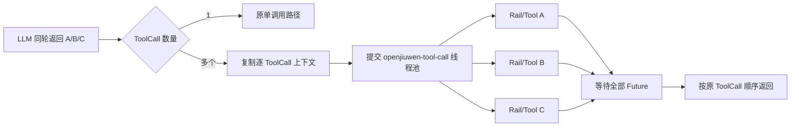
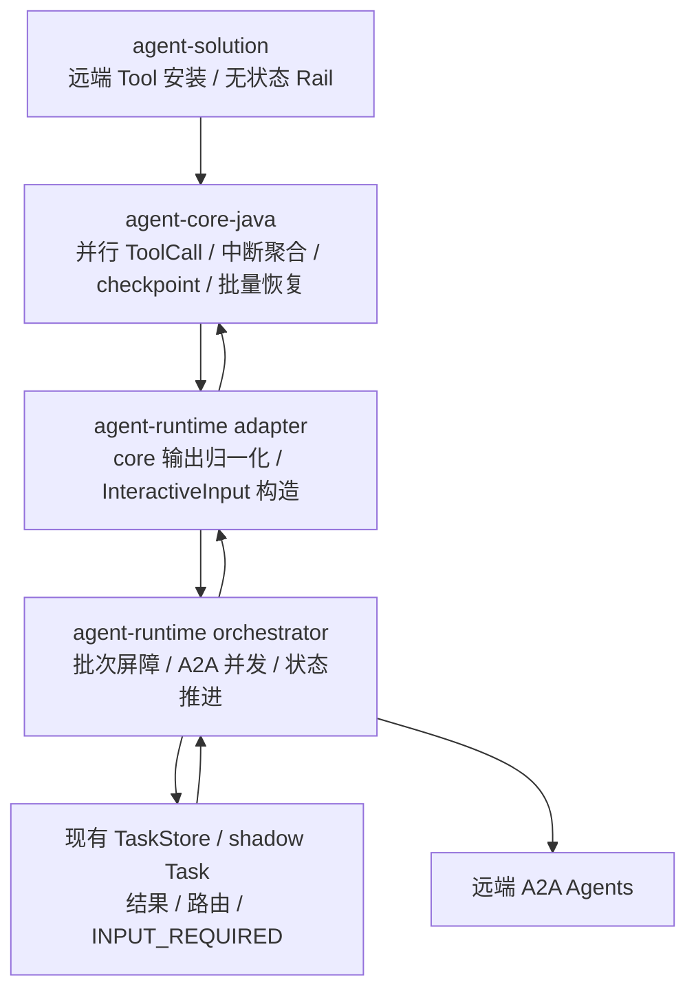
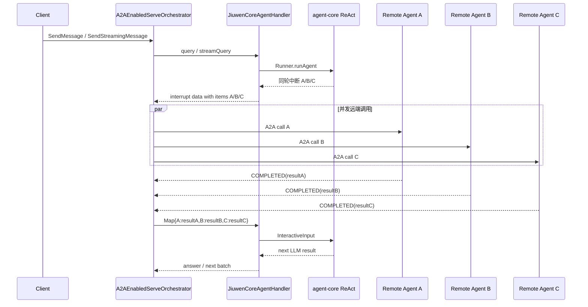

# 支持工具并行执行（agent runtime java）— 设计文档

> 特性编号：026
>
> 目标仓库：`agent-core-java`、`agent-runtime-java`、`agent-solution`
>
> 最后更新：2026-07-16
>
> core 参考设计：`https://gitcode.com/openJiuwen/agent-core-java/issues/33`  需求串讲.md。该文档描述 core 侧 ToolCall 并行和统一线程池方案；本文第 3 章基于该参考设计推导集成契约。core 代码尚未落地，最终以合入后的 core API、测试和行为为准。

---

## 1. 概述

### 1.1 特性定位

当 LLM 在同一轮返回多个互不依赖的 ToolCall 时，agent-core 将并行执行各 ToolCall 的 Rail 和工具逻辑。对于由 `RemoteA2aInterruptRail` 拦截的远端 Agent ToolCall，真正的 A2A 调用发生在 agent-runtime，而不是 core 的工具线程中。因此 runtime 必须识别同一轮产生的全部远端工具中断，将它们组织为一个批次，并发调用远端 Agent，等待批次达到可回灌状态后，一次性按 `toolCallId` 将完整结果集合回灌 core。

改造前：

```text
同轮 ToolCall A/B/C
  -> runtime/adapter 只保留一个中断
  -> 只调用一个远端 Agent
  -> 用普通字符串恢复 core
  -> 多个 ToolCall 可能收到同一个结果，或其余中断丢失
```

改造后：

```text
同轮 ToolCall A/B/C
  -> adapter 在现有 interrupt data 中汇总同轮 items
  -> runtime 并发执行远端调用 A/B/C
  -> 每个结果按 toolCallId 归档
  -> 批次屏障等待所有成员达到本轮稳定状态
  -> 一次 InteractiveInput{A:resultA,B:resultB,C:resultC} 恢复 core
```

### 1.2 当前事实边界

当前三个仓库中的已知事实如下：

| 仓库 | 当前事实 | 与本特性的差距 |
|---|---|---|
| `agent-core-java` | ReAct 已支持收集多个 `ToolInterruptException`、生成一个 `ToolInterruptionState`，恢复输入支持 `InteractiveInput.userInputs` 按 `toolCallId` 映射；当前本地 `feature/630` 的 `AbilityManager.execute()` 仍为串行循环。 | 参考设计中的 ToolCall 并行、独立上下文、统一线程池尚未落地；流式 checkpoint 完成信号需要补齐。 |
| `agent-runtime-java` | `JiuwenCoreAgentHandler` 可转换单个 core 中断；`A2AEnabledServeOrchestrator` 可完成单个远端 Agent 的中断、调用和恢复。 | 非流式只保留最后一个中断；流式 `AtomicReference` 会覆盖前序中断；shadow task 只能保存一个远端调用；恢复请求没有构造 `InteractiveInput`。 |
| `agent-solution` | `RemoteA2aToolInstaller` 可向 ReAct/DeepAgent 安装远端工具；`RemoteA2aInterruptRail` 可将单个 ToolCall 转为 A2A 委派中断。 | Rail 必须保持逐 ToolCall 无状态、线程安全；solution 不应承担批次聚合、并发调度或持久化。 |

本文定义目标设计，不把尚未合入的 core 或 runtime 行为描述为已实现事实。

### 1.3 核心设计原则

1. **同轮批次是最小恢复单元** — core 只有在同轮全部中断 ToolCall 获得结果后才能进入下一轮 LLM 推理，runtime 不做单结果提前回灌。
2. **并发执行与有序关联分离** — 远端调用可以任意顺序完成，但结果始终按 `toolCallId` 关联，并按 core 原始 ToolCall 顺序形成诊断视图。
3. **runtime 拥有批次协调状态** — 已完成结果、待输入路由、远端 Task 引用和批次状态属于 runtime Task 编排状态；core checkpoint 仍归 core。
4. **流式与非流式语义一致** — 两种模式共享相同的中断批次、屏障、状态机和恢复载荷，仅对外输出载体不同。
5. **单成员向后兼容** — 单 ToolCall 也被规范化为大小为 1 的批次，兼容原有单中断和普通文本恢复入口。
6. **成员失败相互隔离** — 单个远端调用失败或超时转为该 ToolCall 的错误结果，不取消同批其他成员；父 Task 是否最终失败由恢复后的本地 Agent 决定。

### 1.4 子特性全景

| 子特性 | 职责 | 关键抽象 | 状态 |
|---|---|---|---|
| core 同轮 ToolCall 并行 | 并行执行 Rail/工具、按原顺序汇总 | `AbilityManager`, `OpenJiuwenExecutors` | 参考设计，代码未落地 |
| core 批量中断与 checkpoint | 汇总中断、保存上下文、恢复整批 ToolCall | `ToolInterruptionState`, `InteractiveInput` | 聚合基础已存在，并行时序待验证 |
| adapter 批量中断归一化 | 非流式/流式输出统一为现有 interrupt data 的批次 envelope | `JiuwenCoreAgentHandler` | 计划中 |
| runtime 远端并发编排 | 并发调用、结果隔离、批次屏障 | `RemoteInvocationBatchCoordinator` | 计划中 |
| 批次状态持久化 | 复用现有 shadow Task metadata 保存成员结果、远端 Task 路由和待输入游标 | `TaskStore`, shadow Task | 计划中 |
| 批量结果回灌 | 在 handler 内构造按 `toolCallId` 映射的 `InteractiveInput` | `JiuwenCoreAgentHandler` | 计划中 |
| solution Rail 并行兼容 | 独立上下文中生成无共享可变状态的中断 | `RemoteA2aInterruptRail` | 需补充并发验证 |

---

## 2. 功能规格

### 2.1 能力清单

| 能力 | 目标状态 | 说明 |
|---|---|---|
| 同轮多中断完整保留 | 必须 | 不得只保留最后一个 `__interaction__`。 |
| 远端 Agent 并发调用 | 必须 | 同批互不依赖的远端调用并发开始。 |
| toolCallId 精确关联 | 必须 | 中断、远端状态、结果、用户输入和 core 回灌全程使用同一 `toolCallId`。 |
| 批次屏障 | 必须 | 全部成员达到稳定状态前不得恢复 core。 |
| 已完成结果保存 | 必须 | 先完成的 A 结果在 B/C 等待期间不得丢失、重复执行或提前回灌。 |
| 多 INPUT_REQUIRED 精确续轮 | 必须 | 父 Task 同时暴露全部 pending member；每段用户输入通过 `TextPart.metadata.toolCallId` 指定目标。 |
| 单次批量回灌 | 必须 | 全批完成后使用一个 `InteractiveInput` 恢复 core。 |
| 流式/非流式一致 | 必须 | 状态机、结果和恢复载荷一致；流式进度允许交错。 |
| 单成员兼容 | 必须 | 原单远端 Agent 场景不要求调用方改造。 |
| 后续轮次远端调用 | 必须 | 前一批次完成并恢复 core 后，LLM 新一轮产生的新批次允许继续执行。 |
| 取消和超时 | 必须 | 父 Task 取消传播到未完成远端 Task；成员超时形成独立错误结果。 |
| 跨进程执行迁移 | 不承诺 | Redis 可保存快照，但当前事件队列和在途 Future 仍依赖实例亲和。 |

### 2.2 显式排除

| 排除项 | 原因 | 替代或边界 |
|---|---|---|
| runtime 推断 ToolCall 依赖图 | 同轮是否独立由 LLM/core 决定 | 有依赖的工具应由 LLM 放到后续轮次。 |
| runtime 修改 core 工具执行顺序 | core 拥有 Agent 内部执行语义 | runtime 只处理 core 返回的中断批次。 |
| solution 保存批次状态 | solution 是装配和 Rail 扩展层 | 状态由 runtime store 管理。 |
| 把批次状态写入 core checkpoint | 会混淆状态所有权 | core checkpoint 保存 Agent 上下文；runtime store 保存远端编排状态。 |
| exactly-once 远端副作用保证 | A2A 对端能力和崩溃窗口不可由本地单方面消除 | 传播幂等键，提供 at-least-once 防重与审计。 |
| 分布式线程池或跨实例 Future 迁移 | 超出当前单实例事件执行模型 | 使用实例亲和；后续由独立恢复特性解决。 |

### 2.3 行为承诺

- **必须**：每个远端工具中断包含非空 `toolCallId`；缺失时批次按协议错误失败，禁止按工具名猜测关联。
- **必须**：同一 core 执行轮次产生的远端工具中断归入同一个 `batchId`。
- **必须**：同一父 Task 同时最多存在一个活动批次；批次完成后才允许创建下一批。
- **必须**：runtime 只在全部成员可生成 core ToolMessage 结果时调用 core resume。
- **必须**：core resume 使用 `InteractiveInput.userInputs: Map<toolCallId,Object>`，禁止把普通字符串复制给全部中断工具。
- **必须**：批次存在 `INPUT_REQUIRED` 成员时，已完成/失败成员结果持久化，恢复时只继续待输入成员。
- **必须**：父 Task 的 `INPUT_REQUIRED` 消息继续沿用现有 `Message.metadata["_interrupt"]` 保存和续轮透传逻辑；客户端不接触 core checkpoint，也不接触远端 Task 引用。
- **禁止**：收到 A 的结果后对 core 做局部恢复，同时让 B/C 留在 runtime 等待。
- **禁止**：因一个成员失败而取消其他已运行成员，父 Task 主动取消除外。
- **允许**：流式模式下多个远端 Agent 的进度事件交错输出，但每个事件必须带 `batchId`、`toolCallId` 和 `remoteAgentId`。
- **必须**：多个成员同时 `INPUT_REQUIRED` 时，每个输入 `TextPart` 必须携带 `toolCallId`；一条 A2A Message 可以携带多个带标识的 TextPart，分别续接多个成员。
- **必须**：外部续轮只使用父 `taskId + toolCallId` 定位成员，不要求客户端传 `batchId`；runtime 仍可保留内部 `batchId` 用于日志、幂等和诊断。
- **必须**：同一父 Task 生命周期内不得复用 `toolCallId`。若 core 最终只保证单轮唯一，则 `taskId + toolCallId` 不足以抵御旧输入重放，core 合入前必须补齐唯一性契约。
- **禁止**：多个 pending member 时把无 `toolCallId` 的普通文本隐式广播给全部成员。
- **允许**：只有一个 pending member 时，无 `toolCallId` 的普通文本继续走原单成员兼容路径。

---

## 3. agent-core 工具并行与中断逻辑（参考设计）

### 3.1 参考状态与适用范围

本章参考《工具调用并行执行与统一线程池管理 - 需求串讲》：

```text
https://gitcode.com/openJiuwen/agent-core-java/issues/33
需求串讲.md
```

该参考方案尚未在当前本地 core 代码落地。本章用于固定 runtime/solution 的依赖假设，不替代 core 仓库最终 L2/API 文档。core 合入后必须重新核对：

- `AbilityManager.execute()` 的并行分支和返回顺序。
- 每 ToolCall 的 `AgentCallbackContext`、Rail 临时状态和 `SessionContextHolder` 隔离。
- `ToolInterruptException` 的收集方式。
- 非流式和流式的中断输出形态。
- checkpoint 持久化相对中断可见性的完成顺序。
- `InteractiveInput` 部分/完整回灌行为。

### 3.2 ToolCall 并行执行

参考设计规定：一个 ToolCall 保留原路径；多个 ToolCall 分别提交到 `openjiuwen-tool-call-*` 共享线程池。每个任务使用独立回调上下文执行原有 Rail 生命周期，父线程等待全部结果，再按 LLM 输出顺序汇总。



并行只改变执行耗时，不改变以下语义：

- 返回项与原 ToolCall 一一对应，顺序稳定。
- 单工具异常隔离为该工具的错误结果。
- 每个 ToolCall 独立运行 `BEFORE_TOOL_CALL`、实际调用、`AFTER_TOOL_CALL` 和异常 Rail。
- 父上下文在全部任务结束后统一汇总 `steering` 和 `forceFinish`。

独立上下文必须落实到可变状态，而不只是新建 `AgentCallbackContext` 对象。当前 `AbilityManager.execute()` 使用 `.extra(ctx.getExtra())` 共享父 Map；并行实现必须为每个 ToolCall 至少创建顶层防御性副本，例如 `new LinkedHashMap<>(ctx.getExtra())`，使 `_skip_tool` 和 Rail 临时键互不覆盖。不得笼统深拷贝 `extra` 中的任意业务对象，以免破坏原本约定的共享引用语义。

`SessionContextHolder` 基于 `ThreadLocal`。工具任务进入 worker 后、执行任何 `BEFORE_TOOL_CALL` Rail 之前必须绑定当前 Session，并在 finally 中恢复该线程此前的 Session，而不是仅依赖实际 `tool.invoke()` 附近的 set/clear；否则 Rail 和工具辅助逻辑在线程池中可能读取不到正确会话。

### 3.3 Rail 中断聚合

`RemoteA2aInterruptRail` 在 `BEFORE_TOOL_CALL` 为每个远端工具抛出独立的 `ToolInterruptException`。并行任务捕获异常并放回对应 `ToolExecutionEntry`，ReAct 在 `AbilityManager.execute()` 返回后统一扫描完整结果列表。

假设 A/B/C 均为远端 Agent ToolCall：

```text
ToolCall A -> ToolInterruptException(call-A)
ToolCall B -> ToolInterruptException(call-B)
ToolCall C -> ToolInterruptException(call-C)
                   |
                   v
ToolInterruptionState {
  iteration,
  originalQuery,
  interruptedTools: [A, B, C]
}
```

core 不会因为 A 先抛中断就立刻返回；它先等待同轮全部 ToolCall Future 结束，再构造一次完整中断状态。

### 3.4 core 对外中断形态

非流式 ReAct 返回一个结果对象：

```json
{
  "result_type": "interrupt",
  "state": [
    {"type": "__interaction__", "index": 0, "payload": "call-A interrupt"},
    {"type": "__interaction__", "index": 1, "payload": "call-B interrupt"},
    {"type": "__interaction__", "index": 2, "payload": "call-C interrupt"}
  ],
  "interrupt_ids": ["call-A", "call-B", "call-C"]
}
```

流式 ReAct 当前形态是连续输出多个独立 `__interaction__` chunk。adapter 必须在本次 core 流结束前收集全部 chunk，并在现有 `QueryChunk.TYPE_INTERRUPT` 的 data map 中提交一个批次 envelope；不得用 `AtomicReference` 只保留最后一条。

### 3.5 core checkpoint 保存时点

ToolCall Rail 中断不直接调用 `Checkpointer.interruptAgentExecute()`。ReAct 的正常路径是：

```text
等待同轮全部 ToolCall 结束
  -> collectToolInterrupts()
  -> contextEngine.saveContexts(session, null)
  -> commitInterrupt(session, ToolInterruptionState)
  -> 返回 interrupt result
  -> AgentSessionApi.postRun()
  -> Checkpointer.postAgentExecute(session)
  -> 持久化完整 Session 快照
```

因此并行 A/B/C 只保存一次完整 checkpoint，不会在 A、B、C 各自中断时分别保存。checkpoint 保存：

- ModelContext，包括 LLM 产生的 AssistantMessage 和原始 ToolCall。
- `ToolInterruptionState`，包括 iteration、原始 query 和中断 ToolCall 列表。
- 不保存工具线程、Future 或 runtime 已取得的远端结果。

远端 A2A 的已完成结果、远端 Task ID 和待用户输入路由必须保存在 runtime 已有的 shadow Task metadata 中，不新增独立状态存储。

### 3.6 checkpoint 可见性屏障

非流式 `Runner.runAgent()` 在返回调用方前执行 `postRun()`，可以把返回 interrupt 视为 checkpoint 已完成。

流式路径存在额外集成要求：当前 `AgentSessionApi.postRun()` 先关闭 stream emitter，再执行 `postAgentExecute()`。consumer 可能先观察到所有中断 chunk 或 EOF，而 Redis checkpoint 尚未提交。若 runtime 立即完成远端调用并 resume，可能恢复不到刚生成的 `ToolInterruptionState`。

core 并行实现落地时必须满足以下二选一契约，推荐第一种：

1. **推荐：checkpoint-first** — `postAgentExecute()` 成功后再关闭 emitter，使 EOF 成为 checkpoint 已提交屏障。
2. **显式确认事件** — 在 checkpoint 成功后发出 `checkpointCommitted(sessionId, interruptIds)`，runtime 等待该确认再启动可导致快速 resume 的流程。

禁止使用固定 sleep 规避竞态。

### 3.7 core 恢复语义

runtime 最终回灌：

```java
InteractiveInput input = new InteractiveInput();
input.update("call-A", resultA);
input.update("call-B", resultB);
input.update("call-C", resultC);
```

core 恢复时加载 `ToolInterruptionState`，清除当前活动中断标记，按保存的原始 ToolCall 顺序重新执行中断工具。Rail 根据 `toolCallId` 从 `InteractiveInput` 取结果并拒绝再次中断；全部成员解决后，ReAct 才进入下一轮 LLM。

core 技术上可以接收部分 map，但未提供结果的 ToolCall 会再次中断。因此 runtime 契约规定只做完整批次回灌。

---

## 4. 总体架构

### 4.1 职责分层



| 层 | 负责 | 不负责 |
|---|---|---|
| core | 同轮 ToolCall 并行、Rail 生命周期、中断集合、Agent checkpoint、批量恢复 | 远端 A2A 调用和 runtime Task 状态 |
| runtime adapter | core 私有输出到中立批次的转换、完整 `InteractiveInput` 构造 | 远端调用并发和 Task 生命周期 |
| runtime orchestrator | 批次创建、并发调用、屏障、取消、输入路由、恢复时机 | 解释 core checkpoint payload |
| 现有 TaskStore / shadow Task | 在等待用户输入时保存批次协调快照 | 保存 Agent memory 或业务 checkpoint |
| solution | Tool/Rail 安装和远端元数据声明 | 聚合、线程池、批次状态和 A2A 生命周期 |

### 4.2 方案比较与裁决

| 方案 | 描述 | 优点 | 问题 | 裁决 |
|---|---|---|---|---|
| runtime 批次屏障 | runtime 收齐同轮中断、并发调用、完整回灌 | 与 core 恢复模型一致；结果不串线；支持 INPUT_REQUIRED | 需要新增批次状态和测试 | 采用 |
| 单结果即时回灌 | 每个远端结果到达就恢复一次 core | 首结果看似更快 | core 会对未完成 ToolCall 再次中断，不能推进 LLM；流式/非流式更复杂 | 拒绝 |
| runtime 保持串行 | 多个中断逐个调用远端 | 改动小 | 丢失性能目标，且当前单值结构仍可能覆盖中断 | 拒绝 |

---

## 5. 接口与数据模型（Logical View）

### 5.1 规范化中断批次

本特性不新增 `agent-service-spec` 公共 DTO，也不改变 `QueryResponse` / `QueryChunk` SPI。`JiuwenCoreAgentHandler` 继续使用现有 `_interrupt` / `QueryChunk.TYPE_INTERRUPT`，只是把 data 从单成员 map 扩展为内部批次 envelope：

```json
{
  "message": "remote tool batch",
  "batchId": "batch-uuid",
  "items": [
    {
      "index": 0,
      "toolCallId": "call-A",
      "toolName": "weather-agent",
      "message": "query weather",
      "context": {
        "_interrupt_kind": "a2a_delegate",
        "agentName": "weather-agent",
        "_stream_mode": "sse"
      }
    },
    {
      "index": 1,
      "toolCallId": "call-B",
      "toolName": "hotel-agent",
      "message": "query hotel",
      "context": {
        "_interrupt_kind": "a2a_delegate",
        "agentName": "hotel-agent",
        "_stream_mode": "sse"
      }
    }
  ]
}
```

约束：

- `batchId` 由 runtime adapter 首次归一化时生成，并在批次生命周期内稳定。
- `index` 保存 core 原始顺序，只用于稳定展示、日志和测试；结果关联必须使用 `toolCallId`。
- 外层不新增 kind 字段；存在 `items` 列表即表示批次。每个 item 原样保留现有 `context._interrupt_kind`，例如 `a2a_delegate`。
- 单中断继续使用原单成员 map，orchestrator 将其在内存中按大小为 1 的批次处理，保持兼容。
- 批次 envelope 只在 handler 与 orchestrator 内部流转，不写入对外公共 SPI 类型定义。

### 5.2 远端调用批次状态

状态模型作为 `RemoteInvocationBatchCoordinator` 的内部 record/enum 实现，不拆成多个生产文件：

| 对象 | 关键字段 |
|---|---|
| Batch | `batchId`, `parentTaskId`, `state`, `members` |
| Member | `index`, `toolCallId`, `toolName`, `agentName`, `state`, `remoteTaskId`, `streamMode`, `result`, `inputPrompt` |
| Batch state | `RUNNING`, `WAITING_INPUT`, `READY_TO_RESUME`, `CANCELED` |
| Member state | `RUNNING`, `COMPLETED`, `INPUT_REQUIRED`, `FAILED`, `TIMED_OUT`, `CANCELED` |

`batchId` 是 runtime 内部诊断标识，不是客户端续轮参数。客户端使用父 A2A `taskId` 和每个输入 Part 的 `toolCallId`；coordinator 只允许它们命中该父 Task 当前 `_remote_batch` 中处于 `INPUT_REQUIRED` 的成员。

### 5.3 复用 shadow Task 保存状态

不新增 `RemoteInvocationBatchStore` SPI 或实现类。`RemoteInvocationBatchCoordinator` 直接复用构造器中已有的 A2A `TaskStore`。新批次使用父 Task ID 定位 shadow Task：

```text
shadow:<agentId>:<parentTaskId>
```

升级前的单成员任务仍可能使用 `shadow:<agentId>:<conversationId>`；新代码只把它作为 schema v1 的兼容回退，不再用于创建 schemaVersion 2 批次。父 Task ID 进入 shadow key 后，同一 A2A context/conversation 下的不同父 Task 不会互相覆盖。

shadow Task 与真实父 Task 是 TaskStore 中两个不同 Task ID 的记录：

```text
真实父 Task: <A2A parentTaskId>
shadow Task: shadow:<agentId>:<parentTaskId>
```

二者的数据边界如下：

| Task | 顶层 `Task.metadata` | `TaskStatus.message.metadata` | 面向对象 |
|---|---|---|---|
| 真实父 Task | 本特性不新增批次字段，保持既有 metadata | `"_interrupt"` 保存公开待输入提示和 `toolCallId` | A2A 客户端、GetTask、续轮消息 |
| shadow Task | `"_remote_batch"` 保存成员状态、完成结果和远端续轮路由 | 不作为批次权威状态使用 | runtime coordinator |

因此本文提到“父 Task 保存中断”时，准确位置是 `parentTask.status.message.metadata["_interrupt"]`，不是 `parentTask.metadata`；提到“Task metadata 保存批次”时，指的是 shadow Task 的 `Task.metadata["_remote_batch"]`。

shadow Task 的 `Task.metadata` 保存内部远端编排状态。新批次只写 `_remote_batch`，不把任一成员镜像到原顶层单成员字段：

```json
{
  "_remote_batch": {
    "schemaVersion": 2,
    "batchId": "batch-uuid",
    "parentTaskId": "parent-task-001",
    "state": "WAITING_INPUT",
    "members": [
      {
        "index": 0,
        "toolCallId": "call-A",
        "toolName": "weather-agent",
        "agentName": "weather-agent",
        "state": "COMPLETED",
        "result": "result-A"
      },
      {
        "index": 1,
        "toolCallId": "call-B",
        "toolName": "hotel-agent",
        "agentName": "hotel-agent",
        "state": "INPUT_REQUIRED",
        "remoteTaskId": "remote-task-B",
        "streamMode": "sse",
        "inputPrompt": "Please provide city"
      },
      {
        "index": 2,
        "toolCallId": "call-C",
        "toolName": "flight-agent",
        "agentName": "flight-agent",
        "state": "INPUT_REQUIRED",
        "remoteTaskId": "remote-task-C",
        "streamMode": "sse",
        "inputPrompt": "Please provide departure date"
      }
    ]
  }
}
```

数据共存规则：

- 新代码优先读取 `_remote_batch`；没有该字段时按原 `_agent_name/_remote_task_id/...` 单成员逻辑恢复。
- 顶层 `_agent_name/_remote_url/_remote_task_id/_stream_mode` 仅用于读取升级前遗留的单成员 shadow Task；新批次不再写这些字段，也不把多成员伪装成旧单成员任务。
- `members[].result` 保存已经完成但尚未回灌 core 的工具结果，例如 A 的 `result-A`。
- `members[].remoteTaskId/inputPrompt` 保存 B/C 的远端续轮路由。
- `parentTaskId + members[].toolCallId` 是外部输入到内部成员的关联键；`remoteTaskId` 只在 runtime 内部使用。
- core resume 成功并返回下一阶段输出后删除 shadow Task；resume 失败时保留快照供受控重试，避免结果丢失。

真实父 Task 的 `TaskStatus.message.metadata["_interrupt"]` 保持现有保存和复制机制：`A2AAgentExecutor` 保存 coordinator 最终发出的 interrupt map，并在下一次续轮时通过 `copyStoredInterrupt()` 原样复制到 `ServeRequest.metadata`。与当前单成员远端 INPUT_REQUIRED 一致，首次中断中的 `context` 已被 runtime 实时消费并拆入 shadow 路由，不再复制到父 Task；多 pending 场景只扩展公开的待输入项，不保存 A 的完成结果、远端 `remoteTaskId`、`agentName` 或 `streamMode`：

```json
{
  "_interrupt": {
    "message": "Multiple remote agents require input",
    "items": [
      {
        "toolCallId": "call-B",
        "toolName": "hotel-agent",
        "message": "Please provide city"
      },
      {
        "toolCallId": "call-C",
        "toolName": "flight-agent",
        "message": "Please provide departure date"
      }
    ]
  }
}
```

父 Task `_interrupt.items[]` 的公开字段约束：

- `toolCallId`：必填，客户端回答时写入对应 `TextPart.metadata.toolCallId`。
- `message`：必填，向用户展示该成员需要的输入。
- `toolName`：可选，仅用于界面展示和诊断，runtime 路由不得依赖它。
- 禁止放入 `agentName`、`remoteTaskId`、`streamMode`、已完成结果或首次 `InterruptRequest.context`。

这保持现有分工：shadow `Task.metadata` 是 orchestrator 内部权威状态；真实父 Task 的 `Message.metadata` 是面向客户端的 `INPUT_REQUIRED` 提示和续轮透传数据。输入目标以本次 A2A Message 的 `TextPart.metadata.toolCallId` 为准，不能根据 `_interrupt` 猜测；首次路由所需的 `items[].context` 只存在于 handler 到 coordinator 的内部批次。

续轮关联关系固定为：

```text
父 taskId + TextPart.metadata.toolCallId
  -> shadow:<agentId>:<parentTaskId>
  -> _remote_batch.members[toolCallId]
  -> agentName / remoteTaskId / streamMode
  -> 恢复对应远端 Agent
```

各类数据的唯一归属如下：

| 数据 | 存放位置 | 是否持久化 | 用途与生命周期 |
|---|---|---|---|
| core 中断批次 envelope | 当前 `QueryResponse` / `QueryChunk.TYPE_INTERRUPT` data | 不持久化 | handler 到 orchestrator 的单次调用内传输，解析后进入 coordinator。 |
| 首次中断 context | 内部 envelope 的 `items[].context` | runtime 不持久化原 Map | coordinator 首次调用前读取 `_interrupt_kind/agentName/_stream_mode`，并把需要的值拆入 shadow member。 |
| 屏障前已完成结果 | coordinator 当前内存 Batch/Member | 不持久化 | 等待同批其他 Future 离开 `RUNNING`；若全批终态则直接恢复 core。 |
| shadow Task 标识 | `TaskStore`，新 key 为 `shadow:<agentId>:<parentTaskId>` | 随 TaskStore 实现 | 复用现有 TaskStore；旧 conversation key 只做 schema v1 读取回退。 |
| 完成结果 A/B/C | shadow `Task.metadata["_remote_batch"].members[].result` | 等待输入期间持久化 | 先完成的结果不回灌、不重跑；整批 resume 成功后随 shadow Task 删除。 |
| 远端续轮路由 | shadow `_remote_batch.members[].remoteTaskId` | 等待输入期间持久化 | 精确续接对应远端 Task；A2A context 继续沿用当前 conversation 映射。 |
| 外部目标输入 | 当前内部 `ServeRequest.metadata` 的 `runtime.parentTaskId`、`runtime.remoteToolInputs` | 不持久化 | adapter 保存父 taskId，并一次解析 TextPart 形成 `Map<toolCallId,text>`，coordinator 本轮消费。 |
| 兼容字段 | shadow 顶层 `_agent_name/_remote_task_id/...` | 仅历史任务可能存在 | 新代码只读回退，不为 schemaVersion 2 批次写入。 |
| 对外中断提示 | 真实父 Task `TaskStatus.message.metadata["_interrupt"]` | 随父 Task 状态 | 沿用现有 map 的保存和续轮复制，只含公开提示及 toolCallId，不保存已完成结果、首次 context 或远端路由。 |
| core 中断上下文 | core checkpoint 中的 `ToolInterruptionState` | 由 core checkpointer 决定 | 保存原始 A/B/C ToolCall、`InterruptRequest.context` 和 Agent 上下文，不保存远端结果。 |
| 整批恢复载荷 | 当前内部 `ServeRequest.metadata["runtime.remoteToolResults"]` | 不持久化 | coordinator 从 shadow 快照构造，handler 消费后转为 `InteractiveInput`。 |

### 5.4 core 恢复载荷

不新增 `CoreResumePayloadFactory` 文件。`JiuwenCoreAgentHandler` 在现有 `buildInputs()` 附近增加私有 helper：当内部 `ServeRequest.metadata["runtime.remoteToolResults"]` 存在时，将其转换为 core 原生 `InteractiveInput`。该字段只是 orchestrator 到 handler 的单次调用内传输，不写入真实父 Task、shadow Task 或外部 A2A Message。恢复载荷必须是对象，不是普通用户消息：

```text
ServeRequest.metadata["runtime.remoteToolResults"]
  -> Map<toolCallId, result>
  -> JiuwenCoreAgentHandler 私有转换方法
  -> InteractiveInput
  -> Runner.runAgent(...)
```

对外 A2A Message 仍保持标准协议；`runtime.remoteToolResults` 和 `InteractiveInput` 只存在于 runtime orchestrator 到 core adapter 的内部边界。

---

## 6. 核心处理流程（Process View）

### 6.1 首轮中断与并发调用



执行规则：

1. adapter 收齐 core 的全部中断后才返回一个现有 interrupt data batch envelope。
2. coordinator 校验 `toolCallId` 唯一、远端 Agent 可解析、当前不存在活动批次。
3. coordinator 同时发起现有 `A2ARemoteAgentClient.callStreaming()`，复用客户端返回的 `CompletableFuture`，不新建 runtime 线程池。
4. 初始远端调用尚未全部稳定时，先完成结果保存在 coordinator 当前调用栈的内存 batch 中；当前架构本就不承诺在途 Future 的跨重启恢复。
5. 批次屏障只在全部成员离开 `RUNNING` 后判定下一步。
6. 全部成员为 `COMPLETED/FAILED/TIMED_OUT` 时直接形成完整结果 map 并恢复 core，无需落 shadow Task。
7. 只要存在 `INPUT_REQUIRED`，就把包含已完成结果和全部待输入路由的快照一次写入现有 shadow Task metadata，再由父 Task 的现有 `_interrupt` 载荷暴露全部公开待输入项；首次中断的 context 不写入父 Task。

### 6.2 INPUT_REQUIRED 与已完成结果保存

示例：A 完成，B/C 需要用户输入。

```text
内存 accumulator
  A = COMPLETED(resultA)
  B = INPUT_REQUIRED(promptB, remoteTaskB)
  C = INPUT_REQUIRED(promptC, remoteTaskC)
          |
          v 一次写入现有 shadow Task.metadata
_remote_batch = WAITING_INPUT
members = [A(resultA), B(remoteTaskB), C(remoteTaskC)]
          |
          v
父 Task = INPUT_REQUIRED(promptB, promptC)
```

此时：

- A 不回灌 core，也不会重新调用远端。
- B/C 的 `remoteTaskId` 和 prompt 被保存；A2A context 继续使用当前 conversation 映射，不新增成员级 context 字段。
- B/C 同时保持 `INPUT_REQUIRED`，不选择 active member；客户端可在下一条 A2A Message 中只回答其中一个，也可用多个带 `toolCallId` 的 TextPart 同时回答多个。
- core checkpoint 保存原始 A/B/C 中断；shadow `Task.metadata` 保存远端执行进度，二者通过 `toolCallId` 对齐。

父 Task status message 示例：

```json
{
  "role": "agent",
  "parts": [{"kind": "text", "text": "Multiple remote agents require input"}],
  "metadata": {
    "_interrupt": {
      "message": "Multiple remote agents require input",
      "items": [
        {
          "toolCallId": "call-B",
          "toolName": "hotel-agent",
          "message": "Which city?"
        },
        {
          "toolCallId": "call-C",
          "toolName": "flight-agent",
          "message": "Which departure date?"
        }
      ]
    }
  }
}
```

### 6.3 用户输入路由

外部续轮不传 `batchId`，而是使用 A2A Message 自带的父 `taskId` 和每个 `TextPart.metadata.toolCallId`。例如一次分别回答 B/C：

```json
{
  "message": {
    "taskId": "parent-task-001",
    "parts": [
      {
        "kind": "text",
        "text": "Beijing",
        "metadata": {"toolCallId": "call-B"}
      },
      {
        "kind": "text",
        "text": "2026-07-20",
        "metadata": {"toolCallId": "call-C"}
      }
    ]
  }
}
```

协议归一化只遍历一次 TextPart：

1. `A2aJsonRpcController` 构造 `TextPart(text, metadata)`，不得像当前实现一样丢弃 Part metadata。
2. `A2AProtocolAdapter` 对完全无 `toolCallId` 的普通消息继续按现有规则拼接为一个 query。
3. 存在 `toolCallId` 时，adapter 按 `toolCallId` 分组；同一 ID 的多个 TextPart 按原顺序拼接，不同 ID 永不互相拼接。
4. adapter 先把外部 params metadata 复制为可变 map，再用 `A2AMessageContext.taskId` 覆盖内部 `runtime.parentTaskId`，并用本次 Part 解析结果覆盖 `runtime.remoteToolInputs: Map<toolCallId,text>`；外部同名字段不可信且不得生效。orchestrator 直接消费该内部 map，不再次解析 TextPart。
5. coordinator 用父 `taskId + toolCallId` 校验并查找 `_remote_batch.members[]`，再取得内部 `remoteTaskId` 发起对应远端续轮。
6. 一条请求命中多个成员时并发续轮；只命中 B 时 C 保持 `INPUT_REQUIRED`，不会被隐式广播或按顺序自动续接。

兼容和错误规则：

- shadow 中只有一个 pending member 时，允许一个无 `toolCallId` 的普通文本恢复该唯一成员。
- shadow 中有多个 pending member 时，每个用于续轮的 TextPart 都必须有 `toolCallId`；不提供时拒绝请求。
- `toolCallId` 不存在、属于其他父 Task，或对应成员不处于 `INPUT_REQUIRED` 时拒绝请求。
- 不支持 `applyToAll`，也不支持任何默认广播语义。
- `A2AAgentExecutor` 继续复用现有 `copyStoredInterrupt()`，把父 Task 上一次保存的 `_interrupt` 原样复制到本次 `ServeRequest.metadata`；该数据不替代本次 TextPart 的目标标识。

### 6.4 批量回灌与下一轮

```text
Batch READY_TO_RESUME
  -> resultsByToolCallId = {
       call-A: resultA,
       call-B: resultB,
       call-C: resultC
     }
  -> JiuwenCoreAgentHandler 私有 helper 创建 InteractiveInput
  -> JiuwenCoreAgentHandler 调用 Runner
  -> core 按 ToolInterruptionState 原顺序恢复 A/B/C
  -> 全部 ToolMessage 加入 ModelContext
  -> 下一轮 LLM
  -> core 调用成功后删除 shadow Task
```

若 core resume 调用抛错或 checkpoint 暂不可见，保留 `READY_TO_RESUME` shadow 快照，不删除 A/B/C 结果；后续只能以同一 `batchId` 做幂等重试。

若下一轮 LLM 再产生远端 ToolCall，这是一个新 `batchId`，受同样流程处理。原 L2-004 中“resume 后再次远端调用一律视为嵌套错误”的限制由本特性收窄为：同一活动批次未解决时禁止创建第二批；上一批已完成后的正常下一轮远端调用允许执行。

### 6.5 流式与非流式差异

| 项目 | 非流式 | 流式 |
|---|---|---|
| core 原始中断 | 一个 result，`state` 为 list | 多个 `__interaction__` chunk |
| adapter 输出 | 一个 interrupt data batch envelope | 收齐流后输出一个 interrupt data batch envelope |
| 远端进度 | 默认不向客户端输出 | 可交错输出，必须携带成员关联字段 |
| 批次屏障 | 相同 | 相同 |
| INPUT_REQUIRED | 一个 QueryResponse `_interrupt` | 一个 interrupt QueryChunk 后结束本次流 |
| core resume | 一个 `InteractiveInput` | 一个 `InteractiveInput` |

### 6.6 取消、超时与背压

- 父 Task 取消时，coordinator 标记批次 `CANCELED`，取消未开始 Future，并对已获得 `remoteTaskId` 的成员 best-effort 发送 A2A CancelTask。
- 每成员沿用对应远端 Agent 的 `stream-timeout`；超时成员形成 `REMOTE_TIMEOUT` 工具结果，不无限阻塞批次。
- 首版不新增批次级超时或 runtime 并发线程池配置；并发复用 `A2ARemoteAgentClient.callStreaming()` 的异步 Future 和客户端 I/O 资源。批次耗时由最慢成员决定，上界受该批成员中最大的 `stream-timeout` 约束。
- 当前 `ServeOrchestrator` 调用形态是同步的；无论内部使用 `allOf`、逐个 `get` 还是其他 Future 组合方式，调用线程都要等待批次汇合后才能决定 `READY_TO_RESUME` 或 `WAITING_INPUT`。首版接受这一容量边界，但不得把实现写死为 `allOf().join()`；压测需记录等待线程数、最慢成员延迟和超时占比。
- 取消后到达的 late event 记录诊断并丢弃，不允许把批次从 `CANCELED` 改回可恢复状态。

---

## 7. 模块与代码结构（Development View）

### 7.1 agent-runtime-java

生产代码只新增一个内部 coordinator 文件，其余在现有类上做定点修改：

```text
service/
├── agent-service-adapters/
│   └── agent-service-adapters-agentcore/
│       └── .../agentfw/
│           └── JiuwenCoreAgentHandler.java     # 修改：收齐中断并构造 InteractiveInput
└── agent-service-app/
    └── .../
        ├── controller/a2a/
        │   ├── A2aJsonRpcController.java         # 修改：保留 TextPart metadata
        │   └── A2AProtocolAdapter.java            # 修改：按 toolCallId 一次归一化输入
        └── orchestrator/
            ├── A2AEnabledServeOrchestrator.java   # 修改：把批次委托给 coordinator
            └── RemoteInvocationBatchCoordinator.java # 新增：内部状态、并发、shadow metadata
```

测试侧新增 `RemoteInvocationBatchCoordinatorTest`，并修改现有 controller/adapter/handler/orchestrator 测试。没有必要为 batch DTO、member、store、resume factory 和 executor 分别建生产文件。

一个新生产文件是当前最小且可维护的边界：现有 `A2AEnabledServeOrchestrator` 已同时承担流式/非流式入口、单远端调用、INPUT_REQUIRED、shadow Task 和取消逻辑；批次成员状态转换、并发汇合、多目标输入校验与快照序列化是一组独立且需要直接单测的职责。把它们继续内嵌会进一步复制 query/stream 分支，拆成多个 model/store/executor 文件则没有新增公共契约或替换实现的必要。Part metadata 的保留和协议归一化只能在现有 controller/adapter 上定点修改，因此生产代码仍只新增 coordinator 一个文件。

现有类的计划修改：

| 类 | 当前问题 | 目标修改 |
|---|---|---|
| `A2aJsonRpcController` | `extractTextPart()` 使用 `new TextPart(text)`，丢弃输入 Part metadata | 解析并保留 TextPart metadata，使 `toolCallId` 到达 adapter。 |
| `A2AProtocolAdapter` | 把全部 TextPart 无条件拼成一个字符串，且未把父 taskId 放入 ServeRequest | 普通消息保持拼接；目标续轮按 `toolCallId` 分组一次，并写入内部 `runtime.parentTaskId/runtime.remoteToolInputs`。 |
| `JiuwenCoreAgentHandler` | 非流式保留 `lastInterrupt`；流式逐条直接下发 | 完整收集中断，统一输出批次；恢复时识别结果 map 并创建 `InteractiveInput`。 |
| `A2AEnabledServeOrchestrator` | `AtomicReference<QueryChunk>` 只保存一个中断；串行远端调用；一个 shadow member | 委托 batch coordinator；只负责 query/stream 生命周期和结果投射。 |
| `RemoteInvocationBatchCoordinator`（新增） | 当前不存在 | 解析内部 batch envelope，并发调用现有 client，复用 TaskStore 保存 shadow metadata，按父 `taskId + toolCallId` 精确续轮。 |

以下现有生产类首版不需要修改：

- `A2ARemoteAgentClient`：现有 streaming 调用已经返回 `CompletableFuture`，可直接并发组合。
- `A2AAgentExecutor`：现有逻辑已经把完整 interrupt map 写入 `TaskStatus.message.metadata["_interrupt"]`，并在 resume 时复制到 `ServeRequest.metadata`。

### 7.2 agent-solution

```text
common/agent-runtime-ext-java/
└── agent-service-adapters-agentcore-ext/
    └── .../external/
        ├── RemoteA2aInterruptRail.java   # 每 ToolCall 独立产生中断
        └── RemoteA2aToolInstaller.java   # 安装 Rail，不持有执行批次
```

solution 约束：

- `RemoteA2aInterruptRail.resolveInterrupt()` 不读写全局“当前 ToolCall”变量。
- `specsByToolName` 为构造后不可变 map。
- core 在收集中断时使用 `ToolCallInterruptRequest.fromToolCall()` 补充 `toolCallId/toolName`；远端调用输入继续来自 Rail 构造的 `InterruptRequest.message`。`ToolCallInterruptRequest` 本身不携带 arguments。
- resume 结果只由 core 根据 `toolCallId` 分发；Rail 不缓存远端结果。
- `RemoteA2aToolInstaller.install()` 的重复安装保护继续按 Agent 实例同步，不参与执行期并发。

上述现有实现已满足无共享可变执行状态的基础条件，首版不修改 solution 生产代码，只补充并发和多中断集成测试。

### 7.3 agent-core-java 依赖点

runtime/solution 不直接实现 core 线程池，但依赖以下目标类型/行为：

```text
AbilityManager.execute()          # 多 ToolCall 并行，按原顺序返回
OpenJiuwenExecutors               # core 统一执行器
AgentCallbackContext              # 每 ToolCall 独立 extra 顶层 Map 和 Rail 临时状态
SessionContextHolder              # worker 入口绑定 Session，finally 恢复此前值
ToolInterruptionState             # 同轮中断集合
ToolCallInterruptRequest          # toolCallId/toolName
InterruptRequest.message          # 远端调用输入；原 arguments 由 Rail 转换
InteractiveInput                  # Map<toolCallId,result>
AgentSessionApi / Checkpointer    # checkpoint 可见性屏障
```

---

## 8. 配置与存储（Physical View）

### 8.1 配置

首版不新增 runtime 配置。继续使用每个远端 Agent 现有的 `stream-timeout` 控制成员超时：

```yaml
agent-runtime:
  remote-agents:
    - url: http://weather-agent:18081
      stream-timeout: 30s
    - url: http://hotel-agent:18082
      stream-timeout: 60s
```

core 参考设计中的 `openjiuwen.executor.tool-call.*` 只控制 core ToolCall/Rail 线程池。runtime 通过现有 A2A client 异步 Future 并发，不在本特性中新增第二套线程池参数。若后续压测证明需要 runtime 级并发上限，应作为容量治理增量设计，而不是在首版预置未验证配置。

### 8.2 存储与部署

| 模式 | 批次状态位置 | 保证 |
|---|---|---|
| 默认 InMemory TaskStore | shadow Task metadata 位于宿主 JVM | 同进程等待/恢复；重启后不保证。 |
| Redis-backed TaskStore | 同一 shadow Task metadata 序列化到 Redis | 保存 WAITING_INPUT 快照和已完成结果；仍不恢复 Future、事件队列和 SSE 连接。 |

本特性不增加跨实例恢复承诺。一条续轮 Message 命中的多个 pending member 由同一个 coordinator 并发执行，并在汇合后一次更新 shadow Task；同一父 Task 仍保持实例亲和，不要求新增 CAS SPI。

---

## 9. 对外场景（Scenario View）

### 9.1 全部远端调用成功

```text
LLM -> A/B/C 三个远端 ToolCall
runtime -> 并发 A2A A/B/C
A/B/C -> COMPLETED
runtime -> 一次 InteractiveInput(A,B,C)
core -> 下一轮 LLM
parent Task -> COMPLETED 或继续执行
```

预期：总耗时接近最慢成员耗时，而不是三者之和；core 上下文中的 ToolMessage 与原 ToolCall 正确配对。

### 9.2 部分完成、部分需要输入

```text
A = COMPLETED
B = INPUT_REQUIRED
C = COMPLETED
  -> 保存 A/C 结果和 B remoteTaskId
  -> parent INPUT_REQUIRED
用户回答 B
  -> 只恢复远端 B
B = COMPLETED
  -> 一次回灌 A/B/C
```

预期：A/C 不重复调用，不提前进入 core 下一轮。

### 9.3 多个远端 Agent 同时需要输入

```text
A = COMPLETED(resultA)
B = INPUT_REQUIRED(promptB)
C = INPUT_REQUIRED(promptC)
  -> shadow 保存 A/B/C
  -> parent INPUT_REQUIRED(items=[B,C])
用户一条 A2A Message:
  TextPart(inputB, toolCallId=B)
  TextPart(inputC, toolCallId=C)
  -> 并发恢复远端 B/C
B = COMPLETED(resultB), C = COMPLETED(resultC)
  -> 一次回灌 A/B/C
```

预期：输入不串线；客户端不传 `batchId`；只回答 B 时 C 继续等待；无目标文本不会广播。

### 9.4 一个成员失败

```text
A = COMPLETED(resultA)
B = FAILED(REMOTE_UNAVAILABLE)
C = COMPLETED(resultC)
  -> InteractiveInput {
       A: resultA,
       B: structured error result,
       C: resultC
     }
```

预期：core/LLM 可以基于 B 的工具错误选择降级、重试或回答；runtime 不因 B 自动丢弃 A/C。

### 9.5 取消

父 Task 在批次运行或等待输入期间被取消：

- 未开始成员取消 Future。
- 已有 remoteTaskId 的成员 best-effort CancelTask。
- 批次持久化为 `CANCELED` 后清理活动索引。
- 禁止再恢复 core。

---

## 10. 错误处理

| 场景 | 触发条件 | runtime 行为 | 对外结果 |
|---|---|---|---|
| 中断缺少 toolCallId | core/adapter 数据不完整 | 拒绝创建批次，记录协议错误 | parent FAILED，`CORE_INTERRUPT_CORRELATION_MISSING` |
| toolCallId 重复且内容一致 | 同一中断重复投递 | 幂等去重 | 不重复远端调用 |
| toolCallId 重复但内容冲突 | 同 ID 对应不同工具/参数 | 批次失败 | `CORE_INTERRUPT_CORRELATION_CONFLICT` |
| 远端不可达 | 连接失败/HTTP 5xx | 成员 `FAILED`，生成工具错误结果 | 其他成员继续 |
| 成员超时 | 超过 endpoint stream-timeout | best-effort cancel，成员 `TIMED_OUT` | 工具结果 `REMOTE_TIMEOUT` |
| 多 pending 时输入缺少 toolCallId | 无法确定目标成员 | 不调用任何远端成员，不广播 | `REMOTE_TOOL_INPUT_TARGET_REQUIRED` |
| toolCallId 不在当前父 Task 批次 | 过期、伪造或串 Task 输入 | 拒绝该输入 | `REMOTE_TOOL_INPUT_TARGET_UNKNOWN` |
| toolCallId 对应成员不是 INPUT_REQUIRED | 重复或状态冲突 | 拒绝该输入，保留现有结果 | `REMOTE_TOOL_INPUT_STATE_CONFLICT` |
| 父 taskId 与 shadow parentTaskId 不匹配 | shadow 损坏或跨 Task 请求 | 拒绝整个续轮 | `REMOTE_BATCH_PARENT_MISMATCH` |
| 多 pending 时带标识和无标识 Part 混用 | 无标识 Part 无法确定目标 | 拒绝整个续轮，不做部分发送 | `REMOTE_TOOL_INPUT_TARGET_REQUIRED` |
| 活动批次冲突 | 前一批未结束又产生新批 | 不覆盖 shadow Task | parent FAILED，`REMOTE_BATCH_ALREADY_ACTIVE` |
| shadow Task 保存失败 | Redis/TaskStore 不可用 | 不暴露 READY/INPUT_REQUIRED，不恢复 core | parent FAILED 或保持 WORKING 后失败收敛 |
| core checkpoint 未可见 | 流式竞态 | 不允许用 sleep 继续；等待显式屏障或失败 | `CORE_CHECKPOINT_NOT_COMMITTED` |
| 父 Task 取消 | CancelTask | 级联取消并拒绝 late result | parent CANCELED |

成员错误回灌格式必须稳定且可被 LLM 识别，例如：

```json
{
  "ok": false,
  "code": "REMOTE_TIMEOUT",
  "message": "remote A2A stream timed out",
  "remoteAgentId": "hotel-agent"
}
```

---

## 11. 兼容性与迁移

### 11.1 单中断兼容

- adapter 接收到单个 core interrupt 时在内存中按大小为 1 的内部批次处理，不新增公共 DTO。
- runtime 仍允许单 pending member 使用普通用户文本恢复。
- 外部 A2A 方法和 endpoint 不变。

### 11.2 旧 shadow task 兼容

兼容期内 `RemoteInvocationBatchCoordinator` 按以下顺序读取：

- 新 key `shadow:<agentId>:<parentTaskId>`：读取 schemaVersion 2 的 `_remote_batch.members[]`。
- 新 key 不存在时，回退旧 key `shadow:<agentId>:<conversationId>`，读取 `_agent_name/_remote_url/_remote_task_id/_stream_mode` 并转换为一个成员。

新批次只写 parentTaskId key 和 schemaVersion 2 的 `_remote_batch`，不再写顶层旧字段。旧任务完成后删除命中的旧 key，不做批量离线迁移。

### 11.3 中断 envelope 兼容

内部新格式建议：

```json
{
  "batchId": "batch-uuid",
  "items": [
    {
      "toolCallId": "call-A",
      "context": {
        "_interrupt_kind": "a2a_delegate"
      }
    }
  ]
}
```

不定义外层 kind 或 discriminator。adapter/orchestrator 使用结构化规则识别：`items` 是列表时按批次处理，否则按旧单个 `_interrupt` map 处理；`items` 为空、类型错误或成员缺少既有 `context._interrupt_kind` 时按协议错误拒绝。新代码禁止把 list 截断为最后一个元素。

### 11.4 幂等与重放

每个远端调用传播：

```text
runtime.idempotencyKey = <parentTaskId>:<toolCallId>:<attempt>
```

runtime 对同一活动批次的重复执行先查询 shadow `_remote_batch`，已完成成员不重发。若进程在远端已接收请求但尚未保存 remoteTaskId 时崩溃，仍存在重复窗口；远端有副作用的 Agent 必须消费幂等键或自行提供重复保护。

---

## 12. 测试与验收

### 12.1 agent-core-java 契约测试

| 测试项 | 验证点 |
|---|---|
| 多 ToolCall 真并行 | 开始/结束时间重叠，总耗时接近最大值。 |
| 顺序稳定 | 完成顺序不同，返回 `ToolExecutionEntry` 仍按 LLM 顺序。 |
| Rail 上下文隔离 | 每个 ToolCall 的 `extra` 顶层 Map 实例不同，参数改写、`_skip_tool`、steering、forceFinish 不串线。 |
| Session 传播 | worker 中的 BEFORE/AFTER Rail 和工具均可读取正确 `SessionContextHolder`，任务结束后恢复线程此前值。 |
| 三工具中断聚合 | 一个 `ToolInterruptionState` 包含三个 ToolCall。 |
| checkpoint 时点 | 全部 Future 完成后保存一次完整中断快照。 |
| 流式 checkpoint 屏障 | consumer 观察到可恢复完成信号时，checkpoint 已可加载。 |
| 完整 InteractiveInput | A/B/C 对应结果准确，进入下一轮 LLM。 |
| 部分 InteractiveInput | 未提供结果的工具再次中断，证明 runtime 必须整批回灌。 |

### 12.2 agent-runtime-java 单元测试

| 测试项 | 验证点 |
|---|---|
| 非流式多中断转换 | `state` 中全部 interrupt 被保留。 |
| 流式多中断转换 | 三个 chunk 汇总一个 batch，不被 AtomicReference 覆盖。 |
| Part metadata 保留 | JSON-RPC 输入的 `TextPart.metadata.toolCallId` 不在 controller 中丢失。 |
| 普通文本兼容 | 全部 Part 无 toolCallId 时仍按现有顺序拼成一个 query。 |
| 多目标输入归一化 | 不同 toolCallId 分别形成输入；同一 ID 的多个 Part 只在该组内按序拼接。 |
| 内部 metadata 防伪造 | 外部 params metadata 中伪造的 `runtime.parentTaskId`、`runtime.remoteToolInputs` 被 adapter 覆盖。 |
| 并发远端调用 | A/B/C 开始时间重叠。 |
| 原顺序诊断 | 完成顺序 C/A/B，batch members 仍为 A/B/C。 |
| 完整结果 map | 每个 toolCallId 得到自己的结果。 |
| 部分 INPUT_REQUIRED | 完成结果和 pending 路由均持久化。 |
| 多目标同时续轮 | 一条 Message 中 B/C 两个目标输入分别且并发续接对应 remoteTaskId。 |
| 子集续轮 | 只提供 B 时仅续接 B，C 继续 INPUT_REQUIRED。 |
| 缺少目标 | 多 pending 时无 toolCallId 的输入被拒绝，不广播。 |
| 父 Task/目标校验 | taskId 或 toolCallId 不属于当前 shadow batch 时拒绝续轮。 |
| 单成员文本兼容 | 原单远端 resume 行为保持。 |
| 成员失败隔离 | B 失败不取消 A/C。 |
| 超时 | 超时成员产生错误结果，批次不永久等待。 |
| 取消 | 未完成成员和远端 Task 被取消，late result 不回灌。 |
| shadow schema 迁移 | 旧单成员 metadata 可恢复，新写入为 v2。 |
| 重复中断 | 相同 toolCallId 幂等，不重复 A2A。 |
| stale resume | 父 taskId 或 toolCallId 与当前批次不匹配时被拒绝。 |
| store 失败 | 不会在状态未持久化时恢复 core。 |

### 12.3 agent-solution 单元测试

| 测试项 | 验证点 |
|---|---|
| Rail 并发调用 | 同一 Rail 实例并发处理不同 ToolCall，无共享状态覆盖。 |
| 中断关联字段 | `toolCallId/toolName/remoteAgentId` 完整，`remoteInput` 或原 arguments 正确转换为 `InterruptRequest.message`。 |
| resume 分发 | A/B/C 各自读取对应 `InteractiveInput` 值。 |
| ReAct/DeepAgent 安装 | 两类 Agent 均安装远端 Tool，且重复安装幂等。 |

### 12.4 E2E 验收场景

必须覆盖流式和非流式两套入口：

1. 三个远端 Agent 全部完成。
2. 一个完成、两个 INPUT_REQUIRED；用户在一条 Message 中用两个带 toolCallId 的 TextPart 分别完成 B/C，最后一次回灌三项结果。
3. 一个完成、两个 INPUT_REQUIRED；用户只回答 B，C 保持等待，后续再回答 C。
4. 一个超时、两个完成，core 获得完整三项结果。
5. 批次等待输入期间进程内继续执行，已完成成员不重跑。
6. Redis-backed TaskStore 下保存/加载 batch snapshot。
7. 快速远端返回场景验证 core checkpoint 不存在竞态。
8. 前一批完成后，core 下一轮再次产生远端工具批次。

验收日志至少包含：`parentTaskId`、`conversationId`、`batchId`、`toolCallId`、`remoteAgentId`、member state、attempt、latency；禁止记录敏感 tool arguments 和完整结果正文。

---

## 13. L0/L1 对齐与架构裁决

### 13.1 状态所有权

本特性新增的 batch snapshot 是 runtime Task 生命周期的协调状态：

```text
Runtime owned
├── internal batchId / parentTaskId / member state
├── toolCallId correlation
├── completed remote result
├── remoteTaskId
├── INPUT_REQUIRED prompt route
└── resume / cancellation state

Core owned
├── ModelContext
├── ToolInterruptionState
├── Agent iteration
└── framework checkpoint
```

该划分符合 L0 的“单一生命周期 writer”和“中断受治理”：`A2AAgentExecutor`/runtime Task 控制面仍是父 Task 状态唯一 writer；core 不直接写 Task 状态，solution 不保存批次。

### 13.2 上层文档必要性审视

Feat-Func-026 不改变 L0 模块边界，也不新增 L1 公共 SPI/API。上层文档已经以 Task、TaskStore、INPUT_REQUIRED 和 Agent checkpoint 分离描述了该能力所需的稳定边界，因此不为一个 L2 内部批次实现扩写多份 L0/L1 场景。

| 文档 | 审视结论 | 是否修改 |
|---|---|---|
| L0 `boundaries.md` | runtime 已是 Task 生命周期 owner；`_remote_batch` 是既有 Task metadata 内的远端协调快照，不是 core checkpoint，也不形成通用跨实例执行游标。 | 否 |
| L0 `constraints.md` | 批次状态仍只有 runtime 控制面写入，用户续轮仍通过受治理的 INPUT_REQUIRED/恢复路径进入。 | 否 |
| L1 `logical.md` | 已明确 Task metadata/TaskStore 属于 runtime state，Agent checkpoint 属于框架；新增数据可直接落在该边界内。 | 否 |
| L1 `process.md` | 已定义 interrupt -> INPUT_REQUIRED -> 同一 Task 继续执行；按 toolCallId 精确续接 B/C 是该流程的内部多成员展开。 | 否 |
| L1 `physical.md` | 已定义 InMemory/Redis-backed TaskStore 保存 Task metadata，并明确事件队列、Future 和 SSE 不随之迁移。 | 否 |
| L1 `scenarios.md` | 已覆盖同一 Task 的人工输入中断与继续；并行远端工具属于 Feat-026 的专项验收场景。 | 否 |
| L2 `Feat-Func-004` | 原“仅单远端调用、resume 后禁止再次远端调用”与 026 直接冲突；本次文档变更已补充 026 的批次并发和批次完成后新一轮调用边界。 | 是，本次已完成最小修订 |

若未来因整体架构重写而需要在 L0/L1 增加该能力，正文应按 Feat-Func-026 已落地后的 active 能力描述，不使用“计划支持”“未来落地”等过渡措辞。

### 13.3 不修改的上层约束

- L0 的工具治理、幂等、审计、容量、背压和中断治理约束继续有效。
- agent-runtime 不接管业务 Agent checkpoint。
- Redis-backed TaskStore 不自动恢复事件队列、SSE 连接或在途 Future。
- agent-bus 仍负责跨实例/跨信任边界治理；本特性只处理一个 runtime 内的 outbound A2A 编排。

---

## 14. 限制、依赖与落地顺序

### 14.1 当前限制

| 限制 | 影响 | 临时边界 |
|---|---|---|
| core 并行代码未落地 | 无法完成真实集成验证 | 先以契约测试 stub 模拟多中断。 |
| core ToolCall 上下文仍共享 `extra` Map | 并行 Rail 的 `_skip_tool` 和临时状态可能串线 | core 必须为每个 ToolCall 创建顶层 Map 防御性副本，并补充并发隔离测试。 |
| `SessionContextHolder` 不自动跨线程传播 | worker 中的 Rail/工具可能读取不到当前 Session | core 必须在 worker 入口绑定 Session，并在 finally 恢复线程此前值。 |
| core 流式 checkpoint 顺序未确认 | 快速 resume 存在竞态 | core 合入前必须提供 checkpoint 屏障。 |
| TaskStore 无通用原子 CAS | 多实例不能并发推进同一批次 | 保持 Task 实例亲和，单 coordinator 串行写。 |
| 多 pending 输入必须带目标 | 旧客户端只能发送无标识文本 | 单 pending 保持兼容；多 pending 客户端必须支持 `TextPart.metadata.toolCallId`。 |
| 首版无独立 batch timeout | 批次延迟受最慢成员影响，同步调用线程等待汇合 | 由每成员 `stream-timeout` 提供上界，并通过压测评估容量。 |
| exactly-once 不可单边保证 | 崩溃窗口可能重复远端副作用 | 传播幂等键，远端实现重复保护。 |

### 14.2 落地顺序

1. core 合入并验证 ToolCall 并行、每 ToolCall `extra` 隔离、Session worker 绑定、中断聚合、checkpoint-first 和完整 `InteractiveInput` 契约。
2. runtime adapter 完成多中断归一化和批量 resume payload。
3. runtime 新增一个内部 coordinator，复用现有 TaskStore/shadow Task，将 A2A 调用改为并发。
4. runtime 保留 TextPart metadata，按父 `taskId + toolCallId` 精确推进一个或多个 INPUT_REQUIRED；现有父 Task `_interrupt` 继续原样保存和续轮透传。
5. solution 补充 Rail 并发安全和 ReAct/DeepAgent 集成测试。
6. 完成流式/非流式、Redis/InMemory 和故障场景 E2E 验证。

只有第 1-6 项全部完成后，才能把本文 `implementation_status` 从 `planned` 调整为 `implemented`，并把能力清单标记为当前 active 代码事实。
