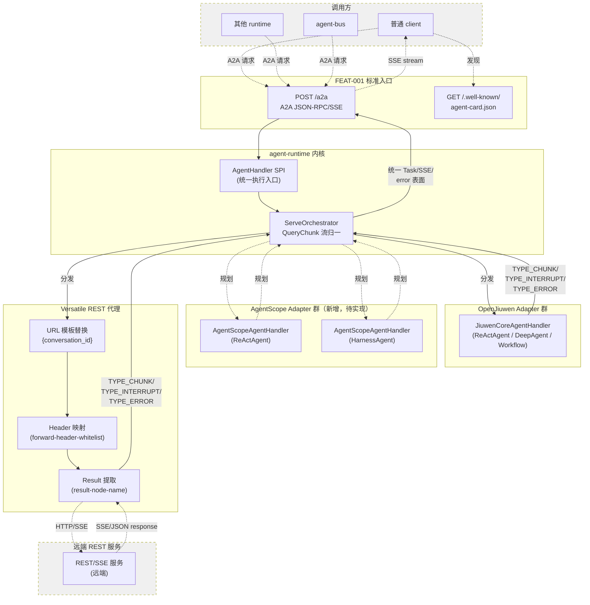
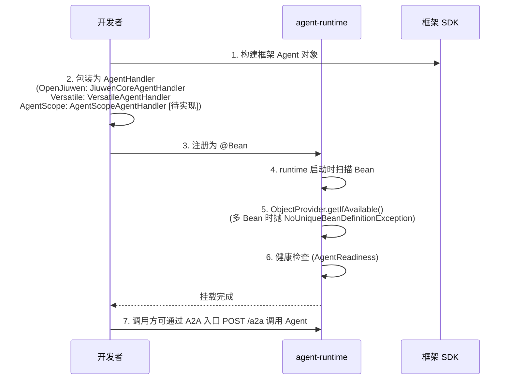
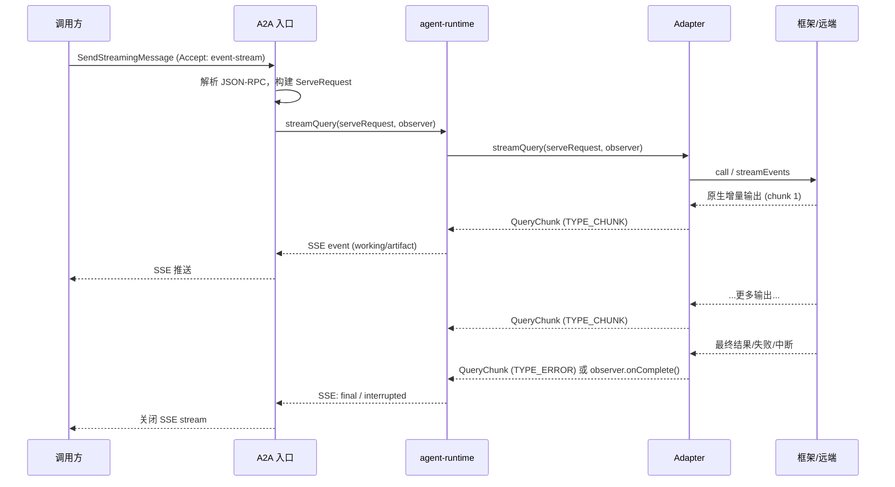
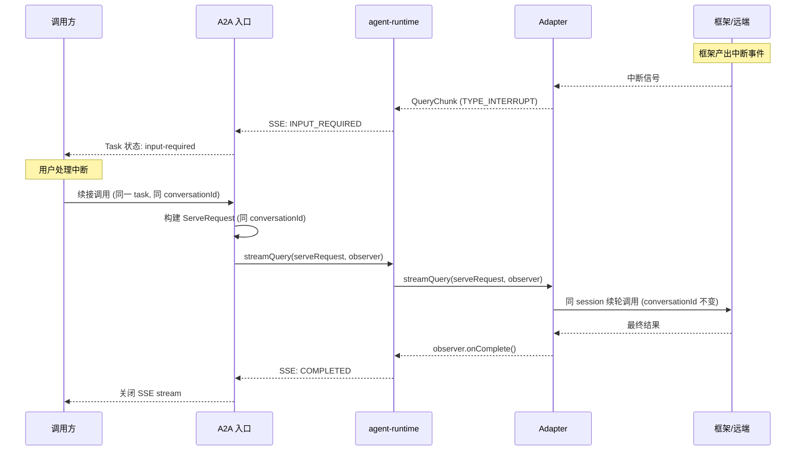
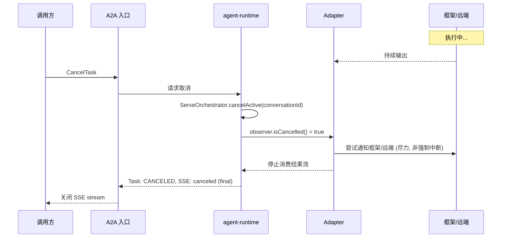
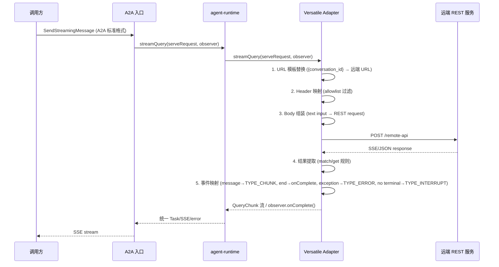

***

version: 0715
module: agent-runtime
feature\_type: functional
feature\_id: FEAT-002
status: active
--------------

# 异构智能体框架兼容特性文档

## 1. 特性定位

FEAT-002 定义 `agent-runtime` 当前版本接入异构 Agent 框架的事实要求，并承载原 FEAT-003 的核心 SPI 与状态边界事实。runtime 必须通过统一的 Adapter / Handler 抽象接入不同 Agent 实现，使上层标准 Agent 服务入口、Task 生命周期、SSE 输出、错误、取消、租户上下文、状态与轨迹语义不依赖具体底层框架。

本特性解决的问题是：OpenJiuwen、AgentScope、远端 REST Agent 服务以及自定义 Agent 实现有不同的 API、执行模型、流式协议、错误表面和扩展机制；`agent-runtime` 必须把这些差异约束在 adapter 内部，向 FEAT-001 定义的标准 Agent 服务入口暴露一致的执行语义。

对下游设计和实现而言，本特性是异构 Agent 接入层的事实来源。L2 设计、adapter 类、指南、示例和测试必须以本文定义的能力、边界和行为语义为准；实现中已经存在但本文未声明的能力，不能自动成为当前版本对外事实承诺。

本特性面向以下角色：

- Agent 开发者：通过通用 `AgentHandler` SPI 或框架专用 adapter 把 Agent 挂载到 runtime。
- 平台集成方：用同一套 A2A 服务入口调用不同框架或远端服务包装出的 Agent。
- Adapter 开发者：为新框架实现执行、结果映射、错误映射、取消和可观测性适配。
- 测试与验收团队：按统一黑盒行为验证不同 adapter 是否产生一致的 Task/SSE/error 语义。

本特性定义 runtime 对异构 Agent 实现的接入与归一化要求，也定义 adapter 层必须依赖的核心 SPI、执行上下文、结果模型、`conversationId` 和单 Agent runtime 边界。标准 northbound A2A 服务入口由 `FEAT-001` 约束；Memory/State 中间件由 `FEAT-004` 约束；远程 Agent 发现、工具安装和中断续接编排由 `FEAT-005` 约束。

## 2. 本次版本能力要求

| 能力                                  | 要求级别   | 本次版本变化 | 事实要求                                                                                                                                                                                                                                    |
| ----------------------------------- | ------ | ------ | --------------------------------------------------------------------------------------------------------------------------------------------------------------------------------------------------------------------------------------- |
| 统一 Handler SPI                      | MUST   | 现有     | 所有本地框架 adapter 和远端代理 adapter 必须通过 `AgentHandler` SPI 接入 runtime；A2A 层不得直接依赖具体框架 SDK。                                                                                                                                                    |
| 统一结果流适配                             | MUST   | 现有     | Adapter 的原生输出必须映射为 `QueryChunk` 流（`TYPE_CHUNK`/`TYPE_INTERRUPT`/`TYPE_ERROR`）或通过 `QueryResponse` 返回聚合结果，覆盖增量输出（`TYPE_CHUNK`）、中断等待输入（`TYPE_INTERRUPT`）、失败（`TYPE_ERROR`）三类 `QueryChunk` 语义，以及通过 `observer.onComplete()` 通知的完成语义。          |
| 框架中立执行上下文                           | MUST   | 现有     | Adapter 必须以 `ServeRequest` 作为执行输入，消费其中的 `tenantId`、`userId`、`conversationId`、`messages`、`metadata` 等运行时上下文，不得重新定义与 runtime 冲突的身份字段。                                                                                                     |
| 单 Agent runtime 执行模型                | MUST   | 现有     | 当前版本一个 runtime 实例只承诺服务一个 Agent。若 Spring 中存在多个 Handler，runtime 通过 `ObjectProvider.getIfAvailable()` 获取唯一 Bean；多个 Bean 时抛出 `NoUniqueBeanDefinitionException`，不承诺 `@Order` 排序选择或同实例多 Agent 路由。                                                                                                                              |
| Adapter 健康与生命周期                     | SHOULD | 现有     | Adapter 应实现健康检查与 start/stop 生命周期，以便 runtime readiness 和运维观测能反映底层框架或远端依赖状态。                                                                                                                                                              |
| 协作式取消                               | MUST   | 现有     | 取消由 `ServeOrchestrator.cancelActive(conversationId)` 在编排层实现；adapter 通过 `QueryStreamObserver.isCancelled()` 检查取消标志并停止消费结果流。是否能立即中断底层 LLM、HTTP 或框架执行，由 adapter 能力决定，不能被夸大为强制中断。                                                           |
| 框架中立错误表面                            | MUST   | 现有     | Adapter 必须把框架原生异常、HTTP 错误、SSE 错误或未知结果映射为 `QueryChunk(TYPE_ERROR)` 或 runtime 标准错误语义，使 A2A 层能形成一致 Task/error 表面。                                                                                                                          |
| 框架中立轨迹接入                            | SHOULD | 现有     | Adapter 应把可观察到的 run、model、tool、progress、error 事件映射到 runtime 轨迹语义；框架不暴露的事件不得伪造为已观测事实。                                                                                                                                                    |
| OpenJiuwen ReActAgent adapter       | MUST   | 现有     | 当前版本必须支持进程内托管 OpenJiuwen `ReActAgent`，使用 runtime 传入的 `conversationId` 作为框架会话标识来源，输出通过 `JiuwenCoreAgentHandler.streamQuery()` 映射为 runtime 结果流。                                                                                           |
| OpenJiuwen Workflow adapter         | MUST   | 现有     | 当前版本必须支持托管 OpenJiuwen `Workflow`，通过 `JiuwenCoreAgentHandler` 包装（与 ReActAgent/DeepAgent 共用），支持人机交互中断（`__interaction__` → `TYPE_INTERRUPT`）、按 runtime `conversationId` 续接调用和 Workflow 输出映射；框架内部 checkpoint/cache 仍由 OpenJiuwen 或智能体开发者自治。 |
| OpenJiuwen DeepAgent adapter        | MUST   | 现有     | 当前版本必须支持托管 OpenJiuwen `DeepAgent`，通过 `JiuwenCoreAgentHandler` 包装（与 ReActAgent/Workflow 共用），中断事件 `__interaction__` 映射为 `TYPE_INTERRUPT`；DeepAgent 的内部规划、工具、skill、memory 和 checkpoint 机制不进入 adapter 治理范围。                                 |
| AgentScope ReActAgent adapter       | MUST   | 新增     | 当前版本必须支持以独立 adapter 托管 AgentScope `ReActAgent`，并将其执行输出、失败和中断语义归一为 runtime 结果流；ReActAgent 的内部推理循环、工具执行、权限系统和上下文管理不进入 adapter 治理范围。                                                                                                       |
| AgentScope HarnessAgent adapter     | MUST   | 新增     | 当前版本必须支持以独立 adapter 托管 AgentScope HarnessAgent，并将其执行输出、失败和中断语义归一为 runtime 结果流；HarnessAgent 的内部规划、工具、skill、memory 和 checkpoint 机制不进入 adapter 治理范围。                                                                                       |
| Versatile REST 代理                   | MUST   | 现有     | 当前版本必须支持把远端 REST/SSE Agent 服务代理为 runtime Agent，完成 A2A Message 到 REST request、REST/SSE response 到 `QueryChunk` 流或 `QueryResponse` 的双向转换。实现于 `agent-service-adapters-versatile` 模块（`VersatileAgentHandler` + `VersatileHttpClient` + `VersatileRequestExtractor` + `VersatileResponseExtractor`）。                                                              |
| Versatile URL 模板                    | MUST   | 现有     | Versatile adapter 必须支持 `{conversation_id}` URL 模板替换（`VersatileRequestExtractor.resolveUrlTemplate()`），使同一 runtime `conversationId` 能稳定映射到远端 conversation。支持 `endpoints[]` 按 `intent` 多 endpoint 路由。                                                                                                                                                     |
| Versatile header 与 metadata 映射      | MUST   | 现有     | Versatile adapter 必须支持 `forward-header-whitelist` header 透传白名单（大小写不敏感匹配）和 `headers-template` 静态 header 覆盖；`headers-template` 优先级高于透传 header。                                                                                                                                                                                |
| Versatile 结果提取                      | MUST   | 现有     | Versatile adapter 必须支持按 `result-node-name` 配置从远端 SSE/JSON payload 中匹配结果节点（`node_name` 子串匹配），从 JSON path `/custom_rsp_data/data` 提取业务结果（`node_type=QA` 且 `text` 非空时提取），并在 terminal event 到达时形成 completed 结果。                                                                                           |
| Versatile 中断检测                      | MUST   | 现有     | 当远端 HTTP/SSE 流关闭但未观察到 `node_type=End` 或 `event=exception` 时，`VersatileResponseExtractor.finish()` 必须映射为 `QueryChunk(TYPE_INTERRUPT, null)`，不得误报 completed。非流式模式下在 result 中填充 `_interrupt` 字段。                                                                                                          |
| Python / Node.js sidecar 原生 adapter | OUT    | 不在本次范围 | 当前版本不承诺直接以 sidecar SDK 方式接入 Python / Node.js Agent。跨语言 Agent 应通过 Versatile REST 代理或独立远端 Agent 方式接入。                                                                                                                                     |
| 同实例多 Agent 路由                       | OUT    | 不在本次范围 | 当前版本不承诺一个 runtime 实例内按 agent id 路由多个 Handler。多 Agent 部署应使用多个 runtime 实例或上层路由。                                                                                                                                                           |
| AgentScope Workflow                 | OUT    | 不在本次范围 | 当前版本不承诺 AgentScope Workflow 适配。                                                                                                                                                                                                         |
| AgentScope Memory / Checkpoint      | OUT    | 不在本次范围 | 当前版本不承诺 AgentScope adapter 原生接入 runtime Memory 或 Checkpoint 中间件。                                                                                                                                                                        |

## 3. 外部接口与入口要求

| 入口                                 | 类型                            | 事实要求                                                                                                                                                                                                                                                                                |
| ---------------------------------- | ----------------------------- | ----------------------------------------------------------------------------------------------------------------------------------------------------------------------------------------------------------------------------------------------------------------------------------- |
| `AgentHandler`                     | Java SPI                      | 所有 adapter 被 runtime 调用的统一执行入口。提供 `query(ServeRequest)` 返回 `QueryResponse`、`streamQuery(ServeRequest, QueryStreamObserver)` 流式回调、`start()` / `stop()` 生命周期、`clearSession(String)` 会话清理。取消由 `ServeOrchestrator.cancelActive(conversationId)` 在编排层实现，健康检查由独立 `AgentReadiness` SPI 承担。 |
| `QueryStreamObserver`              | Java SPI                      | 流式回调接口，提供 `onNext(QueryChunk)` 增量推送、`onError(Throwable)` 错误通知、`onComplete()` 完成通知、`isCancelled()` 取消检查（default false）。                                                                                                                                                              |
| `ServeRequest`                     | Java runtime context          | adapter 执行输入，承载 `conversationId`、`messages`（`List<Map<String,Object>>`）、`userId`、`spaceId`、`tenantId`、`stream`、`metadata`。`conversationId` 同时作为会话标识和续接 key。                                                                                                                         |
| `QueryResponse`                    | Java result model             | 非流式结果表面，承载 `result`（Object，聚合 assistant 输出）和 `conversationId`。                                                                                                                                                                                                                      |
| `QueryChunk`                       | Java stream chunk             | 流式结果表面，通过 `type` 区分三类语义：`TYPE_CHUNK`（增量输出）、`TYPE_INTERRUPT`（中断等待输入）、`TYPE_ERROR`（失败）。                                                                                                                                                                                               |
| `JiuwenCoreAgentHandler`           | Java adapter base             | OpenJiuwen 通用 adapter，通过构造函数注入任意 agent-core Agent 对象（ReActAgent、DeepAgent、Workflow）。`query()` 委托 `Runner.runAgent`，`streamQuery()` 委托 `Runner.runAgentStreaming` 并逐事件映射为 `QueryChunk`。中断事件类型 `__interaction__` 映射为 `TYPE_INTERRUPT`。                                                |
| `AgentScopeAgentHandler`           | Java adapter (待实现)          | AgentScope 适配器入口。应提供 `forReActAgent(ReActAgent)` 和 `forHarnessAgent(HarnessAgent)` 工厂方法，内部创建对应 invoker 并返回 `AgentHandler` 实例。AgentScope 原生事件（`AgentEvent` 流）映射为 `QueryChunk`。                                                                                                       |
| `VersatileAgentHandler`            | Java adapter impl             | 远端 REST/SSE 服务代理入口。实现 `AgentHandler` SPI，通过 `VersatileHttpClient` 发送 HTTP POST，`VersatileRequestExtractor` 组装请求，`VersatileResponseExtractor` 解析 SSE/line stream 并输出 `QueryChunk`。位于 `agent-service-adapters-versatile` 模块（`agent-runtime-ext-java` 仓库）。                                              |
| `openjiuwen.service.versatile.*`   | YAML configuration           | 承载 Versatile URL 模板（`url-template`）、超时（`timeout`）、静态 header（`headers-template`）、header 透传白名单（`forward-header-whitelist`）、结果节点名（`result-node-name`）、多 endpoint 路由（`endpoints[]`）。配置前缀为 `openjiuwen.service.versatile`，通过 `VersatileProperties` 绑定。 |
| `GET /.well-known/agent-card.json` | HTTP endpoint                 | 不属于 adapter 私有入口；任何 adapter 挂载出的 Agent 都必须通过 FEAT-001 的 Agent Card 发现表面暴露能力。                                                                                                                                                                                                        |
| `POST /a2a`                        | HTTP endpoint                 | 不属于 adapter 私有入口；任何 adapter 挂载出的 Agent 都必须通过 FEAT-001 的标准 A2A JSON-RPC/SSE 表面被调用。                                                                                                                                                                                                   |

## 4. 场景与用户旅程

### 4.1 整体流程图

以下流程图展示了异构 Agent 框架兼容的核心链路：从调用方发起 A2A 请求，到 runtime 统一分发至不同 adapter，再到结果归一化返回的全过程。

### 4.2 场景与旅程明细

#### 4.2.1 OpenJiuwen Agent（ReActAgent / DeepAgent / Workflow）

OpenJiuwen 的三种 Agent 类型（ReActAgent、DeepAgent、Workflow）共用 `JiuwenCoreAgentHandler`，执行链路完全一致，差异仅在于中断能力。

| 场景 | 前置条件 | 用户/系统动作 | 期望行为 |
| --- | --- | --- | --- |
| 挂载 Agent | 应用已引入 OpenJiuwen adapter，开发者能构建 `ReActAgent`/`DeepAgent`/Workflow 对象 | `new JiuwenCoreAgentHandler(agent)` 包装，注册为 `@Bean AgentHandler` | runtime 启动时扫描 Bean，通过 `AgentReadiness` 健康检查；A2A 入口可调用。三种 Agent 共用同一 Handler。 |
| 流式调用 | Agent 已挂载，A2A 调用方发送 `SendStreamingMessage` | runtime 构建 `ServeRequest`，调用 `streamQuery(serveRequest, observer)` | handler 委托 `Runner.runAgentStreaming`，逐事件映射为 `QueryChunk(TYPE_CHUNK)`；最终通过 `observer.onComplete()` 通知完成。 |
| 非流式调用 | Agent 已挂载，A2A 调用方发送 `SendMessage` | runtime 构建 `ServeRequest`，调用 `query(serveRequest)` | handler 委托 `Runner.runAgent`，返回 `QueryResponse`（含 result + conversationId）。 |
| 工具调用 | Agent 在推理循环中触发工具 | Runner 内部执行工具调用 | 工具输出作为增量事件映射为 `QueryChunk(TYPE_CHUNK)`；工具执行、权限系统不进入 adapter 治理。 |
| 中断等待输入 | **仅 DeepAgent/Workflow**：执行中产出 `__interaction__` 类型中断事件（DeepAgent 由 `InterruptRail` 触发，Workflow 由人工确认节点触发） | handler 捕获中断事件 | 映射为 `QueryChunk(TYPE_INTERRUPT)`；A2A 层返回 `INPUT_REQUIRED`。**ReActAgent 无此场景**（不含 rails）。 |
| 续接调用 | 调用方收到 `INPUT_REQUIRED` 后用同 task 续接 | runtime 以同一 `conversationId` 构建 `ServeRequest`，调用 `streamQuery` | adapter 以同一 `conversationId` 发起续接调用；内部恢复上下文（checkpoint/cache）由 OpenJiuwen 自治；adapter 不直接读写缓存 payload。 |
| 异常处理 | Agent 执行中抛出异常或超限 | handler 捕获异常 | 映射为 `QueryChunk(TYPE_ERROR)`；DeepAgent 的内部规划、工具、skill、memory 和 checkpoint 机制不进入 adapter 治理范围。 |

> **中断能力差异**：ReActAgent 是纯推理-行动循环，不包含 `InterruptRail`，不产出 `__interaction__` 事件；DeepAgent（通过 `InterruptRail`）和 Workflow（通过人工确认节点）会产出 `__interaction__` 事件，映射为 `TYPE_INTERRUPT`。三种 Agent 的其余执行、映射、异常、续接语义完全一致。

#### 4.2.2 AgentScope ReActAgent

| 场景                       | 前置条件                                                    | 用户/系统动作                                                                           | 期望行为                                                                                                                                                        |
| ------------------------ | ------------------------------------------------------- | --------------------------------------------------------------------------------- | ----------------------------------------------------------------------------------------------------------------------------------------------------------- |
| 挂载 AgentScope ReActAgent | 应用已引入 AgentScope adapter，开发者能构建 AgentScope `ReActAgent` | 开发者调用 `AgentScopeAgentHandler.forReActAgent(agent)` 工厂方法，注册为 `@Bean AgentHandler` | runtime 启动时扫描 Bean；AgentScope 原生事件流（`TextBlockDeltaEvent`、`ToolCallStartEvent` 等）映射为 `QueryChunk(TYPE_CHUNK)`。                                              |
| 流式调用                     | ReActAgent 已挂载，A2A 调用方发送 `SendStreamingMessage`         | runtime 构建 `ServeRequest`，调用 `streamQuery(serveRequest, observer)`                                        | adapter 调用 `agent.streamEvents()`，将 `AgentEvent` 逐事件映射为 `QueryChunk`；`RequireUserConfirmEvent` 映射为 `TYPE_INTERRUPT`；`ExceedMaxItersEvent` 映射为 `TYPE_ERROR`。 |
| 续接调用                     | 调用方收到 `INPUT_REQUIRED` 后用同 task 续接                      | runtime 以同一 `conversationId` 构建 `ServeRequest`                                    | adapter 以同一 `RuntimeContext`（含 `conversationId`）发起续接调用；AgentScope 内部 session 恢复由 AgentScope 自治。                                                             |
| 异常处理                     | ReActAgent 执行中抛出异常                                      | adapter 捕获异常                                                                      | 映射为 `QueryChunk(TYPE_ERROR)`；ReActAgent 的内部推理循环、工具执行、权限系统和上下文管理不进入 adapter 治理。                                                                              |

#### 4.2.3 AgentScope HarnessAgent

| 场景                         | 前置条件                                                                     | 用户/系统动作                                                                             | 期望行为                                                                                                                                                                     |
| -------------------------- | ------------------------------------------------------------------------ | ----------------------------------------------------------------------------------- | ------------------------------------------------------------------------------------------------------------------------------------------------------------------------ |
| 挂载 AgentScope HarnessAgent | 应用已引入 AgentScope adapter + `agentscope-harness` 依赖，开发者能构建 `HarnessAgent` | 开发者调用 `AgentScopeAgentHandler.forHarnessAgent(agent)` 工厂方法，注册为 `@Bean AgentHandler` | runtime 启动时扫描 Bean；HarnessAgent 的 workspace/memory/sandbox/subagent 事件映射为 `QueryChunk` 流；HarnessAgent 内部机制不进入 adapter 治理。                                                |
| 流式调用                       | HarnessAgent 已挂载，A2A 调用方发送 `SendStreamingMessage`                        | runtime 构建 `ServeRequest`，调用 `streamQuery(serveRequest, observer)`                                          | adapter 调用 `agent.streamEvents()`，将 `AgentEvent` 逐事件映射为 `QueryChunk`；`RequireUserConfirmEvent`（HITL 中断）映射为 `TYPE_INTERRUPT`；`ExceedMaxItersEvent`（超限终止）映射为 `TYPE_ERROR`。 |
| 续接调用                       | 调用方收到 `INPUT_REQUIRED` 后用同 task 续接                                       | runtime 以同一 `conversationId` 构建 `ServeRequest`                                      | adapter 以同一 `RuntimeContext`（含 `conversationId`）发起续接调用；HarnessAgent 的 workspace 恢复和 memory 沉淀由 AgentScope 自治。                                                            |
| 异常处理                       | HarnessAgent 执行中抛出异常                                                     | adapter 捕获异常                                                                        | 映射为 `QueryChunk(TYPE_ERROR)`；HarnessAgent 的内部规划、工具、skill、memory 和 checkpoint 机制不进入 adapter 治理范围。                                                                         |

#### 4.2.4 Versatile REST 代理

| 场景              | 前置条件                                             | 用户/系统动作                                                                | 期望行为                                                                                                                 |
| --------------- | ------------------------------------------------ | ---------------------------------------------------------------------- | -------------------------------------------------------------------------------------------------------------------- |
| 挂载 Versatile 代理 | 远端服务提供 REST endpoint 和 SSE/JSON 响应               | 开发者注册 `VersatileAgentHandler` 并配置 `openjiuwen.service.versatile.*`（`url-template`、`timeout`、`headers-template`、`forward-header-whitelist`、`result-node-name` 等） | runtime 启动时扫描 Bean；`VersatileAutoConfiguration` 注册 `VersatileProperties`；adapter 按 URL 模板和 header 白名单初始化。                |
| 流式调用            | Versatile 代理已挂载，A2A 调用方发送 `SendStreamingMessage` | runtime 构建 `ServeRequest`，调用 `streamQuery(serveRequest, observer)`                             | `VersatileRequestExtractor` 用 `{conversation_id}` 替换 URL 模板变量，组装 `RemoteRequest`；`VersatileHttpClient` 发起远端 POST；`VersatileResponseExtractor` 逐行解析 SSE，映射为 `QueryChunk(TYPE_CHUNK)`。 |
| 非流式调用           | Versatile 代理已挂载，A2A 调用方发送 `SendMessage`          | runtime 构建 `ServeRequest`，调用 `query(serveRequest)`                                   | adapter 组装 `RemoteRequest`，发起远端 POST；消费完整响应流后由 `resolveQueryResult()` 聚合为 `QueryResponse`（含 answer 或 `_interrupt`）。                |
| 会话连续性           | runtime 输入带有 session/context/task 语义             | Versatile adapter 用 `{conversation_id}` 替换 URL 模板变量                  | 同一 runtime `conversationId` 稳定映射到远端 conversation，避免跨会话串扰。                                                            |
| 中断检测            | 远端 HTTP/SSE 流关闭但未观察到 End/terminal 事件             | `VersatileResponseExtractor.finish()` 检测到 `isCompleted == false`       | 映射为 `QueryChunk(TYPE_INTERRUPT, null)`；非流式模式下在 result 中填充 `_interrupt` 字段。                                              |
| 异常处理            | 远端 HTTP 4xx/5xx 或 `event=exception` 或网络异常            | adapter 捕获错误                                                           | `VersatileResponseExtractor` 标记 `hasFailed`，映射为 `QueryChunk(TYPE_ERROR)`；保留原始错误数据。                                          |

#### 4.2.5 跨场景行为

| 场景              | 前置条件                                                            | 用户/系统动作                                                     | 期望行为                                                                                                                                          |
| --------------- | --------------------------------------------------------------- | ----------------------------------------------------------- | --------------------------------------------------------------------------------------------------------------------------------------------- |
| Agent 等待用户输入    | OpenJiuwen DeepAgent/Workflow 或 Versatile 远端服务产生中断语义 | 调用方收到 `INPUT_REQUIRED` 后用同 task/context 续接                  | adapter 必须使用同一 `conversationId`、task/context 或远端 continuation 信息发起续接调用；内部恢复上下文由框架或远端服务自治，adapter 不直接读写缓存 payload。                             |
| 调用方取消任务         | A2A client 调用标准 cancel                                          | runtime 调用 `ServeOrchestrator.cancelActive(conversationId)` | adapter 通过 `QueryStreamObserver.isCancelled()` 停止本次结果消费并让 Task 表面进入取消语义；底层是否立即停止由 adapter 能力决定。                                               |
| 多 Handler 被同时注册 | Spring 容器中存在多个 `AgentHandler` Bean                              | runtime 启动并选择执行 Handler                                     | runtime 通过 `ObjectProvider.getIfAvailable()` 获取 Handler；多个 Bean 时抛出 `NoUniqueBeanDefinitionException`，不承诺同实例多 Agent 路由。当前代码未实现 `@Order` 排序选择。 |

### 4.3 关键旅程流程图

#### 4.3.1 开发者挂载 Agent 旅程

#### 4.3.2 运行态调用流程（流式）

#### 4.3.3 中断与续接旅程

#### 4.3.4 取消任务旅程

#### 4.3.5 Versatile REST 代理旅程

## 5. 行为语义与边界

### 5.1 核心行为语义

#### 5.1.1 Adapter 归一语义

- Adapter 是框架差异的吸收层，不是新的 northbound 协议层。
- A2A controller、Task store、readiness gate、trajectory、state/memory scope 必须看到统一的 `AgentHandler` 执行表面。
- Adapter 不得把 OpenJiuwen、AgentScope、Versatile 或其他框架的内部状态机直接暴露为 A2A Task 状态机。
- Adapter 可以保留框架内部 session、conversation、workflow node、remote request id 等字段，但这些字段必须稳定映射到 runtime context 或 metadata，不能覆盖 runtime 的 task/session/tenant 事实字段。
- Adapter 不得实现或代理框架 checkpointer/cache 的读写策略；它只能把 runtime 拥有的 `conversationId`、task/context 和调用生命周期信号传给框架。
- 框架 hook、rail、tool、skill、middleware、callback 等扩展机制不属于本特性承诺的 adapter 能力；如果框架或 Agent 开发者在内部使用这些机制，adapter 只观察最终执行结果。

#### 5.1.2 执行与结果映射语义

- `streamQuery(ServeRequest, QueryStreamObserver)` 必须通过 `onNext` / `onError` / `onComplete` 回调返回可被 runtime 消费的结果流；即使底层框架是同步阻塞调用，也必须包装为统一流式结果。
- 原生增量输出必须映射为 `QueryChunk(TYPE_CHUNK)`；最终成功必须通过 `observer.onComplete()` 通知；异常或不可恢复错误必须映射为 `QueryChunk(TYPE_ERROR)`；需要用户输入、远端继续或连接关闭未终止时必须映射为 `QueryChunk(TYPE_INTERRUPT)`。
- `onComplete()` 不得用于表示"远端还在等待用户输入"或"连接意外关闭但没有 terminal event"的情况。
- 未知原生结果类型必须失败或被显式过滤，不得以空 completed 掩盖。

#### 5.1.3 OpenJiuwen Agent 语义（ReActAgent / DeepAgent / Workflow）

OpenJiuwen 的三种 Agent 类型（ReActAgent、DeepAgent、Workflow）共用 `JiuwenCoreAgentHandler`，类型区分由 `Runner` 内部完成，adapter 层不感知类型。

- 三种 Agent 的 runtime text input 必须映射为 OpenJiuwen input，并以 `conversationId` 维持会话连续性。
- OpenJiuwen streaming runner 或等价执行路径输出的 chunk 必须映射为 runtime 结果流。
- 三种 Agent 正常结束时必须通过 `observer.onComplete()` 通知完成；抛出或返回错误时必须映射为 `QueryChunk(TYPE_ERROR)`。
- **仅 DeepAgent/Workflow**：执行中产出 `__interaction__` 类型中断事件（DeepAgent 由 `InterruptRail` 触发，Workflow 由人工确认节点触发）必须映射为 `QueryChunk(TYPE_INTERRUPT)`；同一 `conversationId` 下的后续用户输入必须由 adapter 传回 OpenJiuwen，内部 checkpoint/cache 恢复由 OpenJiuwen 或智能体开发者自治。**ReActAgent 无此场景**（不含 rails）。
- 三种 Agent 内部 hook、rail、tool、skill、memory、checkpoint、MCP 工具服务调用等机制由 OpenJiuwen 或智能体开发者自治，adapter 不声明这些机制的安装、编排或缓存读写承诺。
- 三种 Agent 虽共用同一 Handler，但分别面向 LLM 自主推理循环、流程编排/人机交互中断和增强推理执行模型，在文档和实现中必须保持类型语义清晰。

#### 5.1.4 AgentScope 语义

- AgentScope ReActAgent 和 HarnessAgent 两种模式最终都必须产出 `AgentEvent` 或等价事件流，并由 adapter 映射为 runtime 结果。
- AgentScope 原生错误码、异常链或远端错误必须映射到 runtime 标准错误分类；未知错误归为内部错误或等价失败。
- AgentScope 可产生 PROGRESS 类轨迹事件；不暴露模型调用回调时，不得伪造 MODEL\_CALL 轨迹。
- 当前版本不承诺 AgentScope 原生 Memory 或 Checkpoint 适配。

#### 5.1.5 Versatile REST 代理语义

- Versatile adapter 必须把 A2A text input 和 metadata 映射为远端 REST request body、URL、query 和 header。
- `{conversation_id}` 必须由 runtime `conversationId`/session 语义派生，确保远端 conversation 与 runtime 会话边界一致。
- Header 透传必须受 allowlist 或 structured metadata 规则控制；不得默认透传所有调用方 metadata。
- 远端 SSE 的 message、workflow\_finished、end、exception、connection\_closed 等事件必须映射为标准 `QueryChunk(TYPE_CHUNK)`、`observer.onComplete()`、`QueryChunk(TYPE_ERROR)` 或 `QueryChunk(TYPE_INTERRUPT)`。
- result extraction 只能影响 completed payload 的组装，不能改变 terminal 状态语义。

#### 5.1.6 错误、取消与可观测性结果

| 场景                    | 事实要求                                                                                 |
| --------------------- | ------------------------------------------------------------------------------------ |
| handler 未就绪或不健康       | runtime 必须拒绝执行或暴露不健康状态，调用方不应看到伪成功结果。                                                 |
| adapter 创建底层 Agent 失败 | 必须映射为 failed Task/error，并记录可诊断错误。                                                    |
| 框架同步调用异常              | 必须映射为 `QueryChunk(TYPE_ERROR)`；不得让异常绕过标准 Task/error 表面。                              |
| 远端 HTTP 超时            | 必须映射为可诊断、可分类的失败错误。                                                                   |
| 远端 HTTP 4xx/5xx       | 必须保留状态码或等价错误 code，并映射为 `QueryChunk(TYPE_ERROR)`。                                     |
| SSE 解析失败              | 应记录并按可恢复性选择跳过单帧或失败整个任务；不得输出破损事件给 A2A 调用方。                                            |
| 流关闭但无 terminal event  | 必须映射为 `QueryChunk(TYPE_INTERRUPT)` 或失败，不能映射为 completed。                              |
| cancel requested      | 必须停止 runtime 对该执行流的继续消费，并尽力通知底层框架或远端请求。                                              |
| trajectory fields     | Adapter 发出的轨迹必须带有 runtime stamped context/task/agent/correlation 语义；敏感字段遵守 DFX 掩码规则。 |

### 5.2 显式边界与不承诺项

| 边界                             | 当前版本不承诺                                                                                                                                                                                                      |
| ------------------------------ | ------------------------------------------------------------------------------------------------------------------------------------------------------------------------------------------------------------ |
| 同实例多 Agent 路由                  | 不承诺在一个 runtime 实例内按 `agentId` 路由多个 Handler；多 Agent 应多实例部署或由上层网关路由。                                                                                                                                           |
| Adapter 私有 northbound endpoint | 不承诺为 OpenJiuwen、AgentScope 或 Versatile 暴露绕过 FEAT-001 的私有执行 endpoint。                                                                                                                                         |
| 状态缓存归属边界                       | 异构框架 adapter 不依赖、不读写、不配置、不治理智能体框架的 checkpointer/cache payload；adapter 只传递 runtime 拥有的 `conversationId`、task/context 和调用生命周期信号。runtime 状态缓存、持久化、revision、fencing、TTL 与租户隔离由 FEAT-004 约束；框架内部执行快照由框架或智能体开发者自治。 |
| 框架扩展机制自治边界                     | 异构框架 adapter 不承诺、不安装、不编排、不治理框架 hook、rail、tool、skill、middleware、callback 等扩展机制。这些机制应由智能体框架提供，或由智能体开发者在构建 Agent 时自定义；adapter 只负责请求桥接、调用执行和结果归一。                                                                |
| 强制中断底层模型调用                     | `cancel` 不承诺立即中断已经进入底层 LLM 或远端服务的阻塞调用。                                                                                                                                                                       |
| AgentScope Workflow            | 不承诺 AgentScope Workflow 适配。                                                                                                                                                                                  |
| AgentScope Memory / Checkpoint | 不承诺 AgentScope adapter 接入 runtime Memory 或 Checkpoint 中间件。                                                                                                                                                   |
| Python / Node.js 原生 sidecar    | 不承诺直接通过进程内 SDK 或 sidecar 协议接入非 Java Agent；应使用 Versatile 或远程 A2A Agent。                                                                                                                                       |
| MCP 作为 Agent adapter           | MCP（Model Context Protocol）是工具服务协议，不是本特性的异构智能体框架 adapter。若智能体框架自身具备调用模型或调用 MCP 服务的能力，该能力由框架或智能体开发者自治，agent-runtime 异构适配不做显式承诺。                                                                                                      |
| REST facade 替代 Versatile       | FEAT-006 的 RESTful client facade 面向业务 client；Versatile adapter 面向代理远端 Agent 服务，二者不得互相替代事实边界。                                                                                                                 |

## 6. 对下游设计与实现的约束

- L2 设计必须把本文作为异构 Agent adapter 层的事实来源，不能把旧实现限制或新增代码能力未经声明地写成事实承诺。
- A2A 层必须只依赖 `AgentHandler` / `ServeRequest` / `QueryChunk` / `QueryResponse` 等框架中立表面，不得导入 OpenJiuwen、AgentScope、Versatile 私有类型。
- 新增 adapter 必须提供执行入口、结果映射、错误映射、取消语义、健康检查策略、配置说明和至少一个可运行示例；不得把框架 cache/checkpointer 读写、hook/rail/tool/skill 编排写成本特性承诺。
- OpenJiuwen ReActAgent、Workflow 与 DeepAgent 虽共用 `JiuwenCoreAgentHandler`，但在文档和实现中必须保持类型语义清晰：三者分别面向 LLM 自主推理循环、流程编排/人机交互中断和增强推理执行模型。
- Versatile adapter 的 URL、header、metadata、result extraction 和中断检测规则必须被测试覆盖，尤其要覆盖“无 End 连接关闭不得 completed”的边界。
- AgentScope adapter 的错误映射和 PROGRESS 轨迹必须被测试覆盖；Memory/Checkpoint 不得在未实现前写入 guide 作为承诺能力。
- 多 Handler 注册只能作为兼容降级路径处理；任何同实例多 Agent 路由设计必须先更新本特性或新增 version-scope 特性。
- 若未来要支持 Python/Node sidecar、AgentScope Workflow、强制取消、多 Agent 路由，或由 runtime 统一治理框架 hook/tool/skill/cache，必须先更新当前版本事实要求，再进入 L2 和实现。

## 7. 关联文档

- `architecture/L2-Low-Level-Design/agent-runtime/FEAT-002-heterogeneous-agent-framework-compatibility.md`
- `version-scope/FEAT-001-standardized-agent-service-entrypoint.md` — 标准 A2A 服务入口
- `version-scope/FEAT-003-agentscope-java-adapter.md` — AgentScope Java 适配器子特性
- `version-scope/FEAT-004`（规划） — Memory/State 中间件
- `version-scope/FEAT-005`（规划） — 远程 Agent 发现、工具安装和中断续接编排
- `version-scope/FEAT-006`（规划） - RESTful client facade

