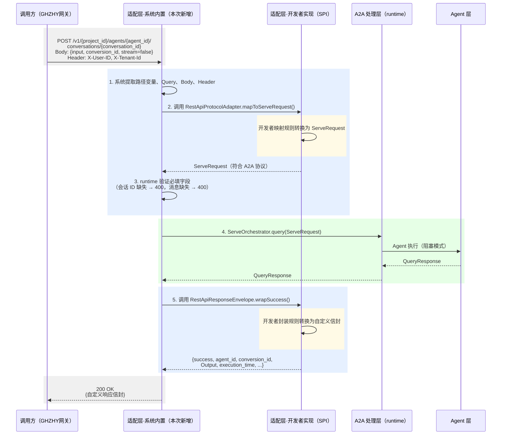
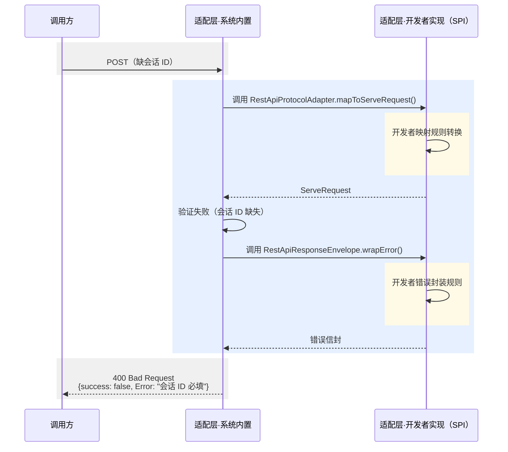
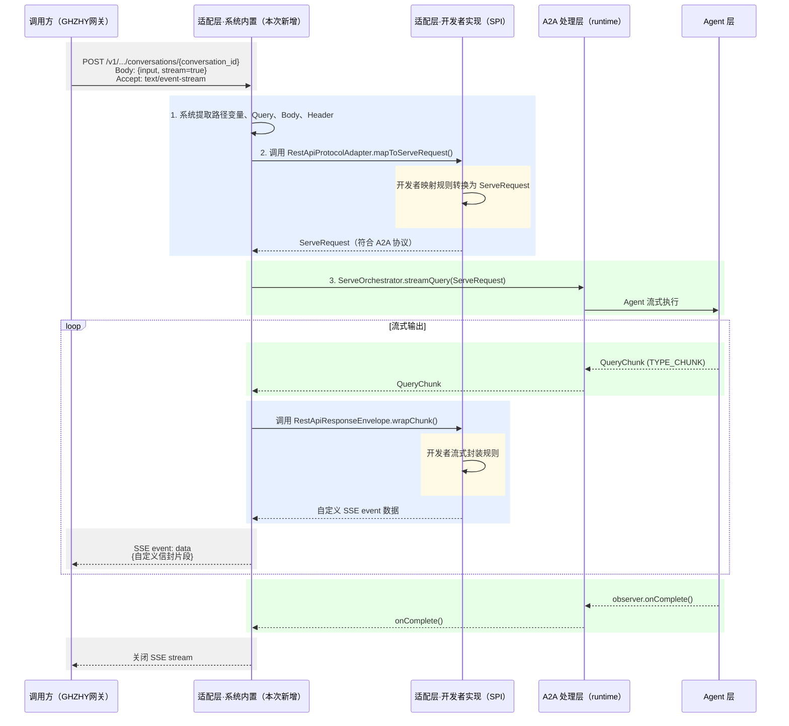
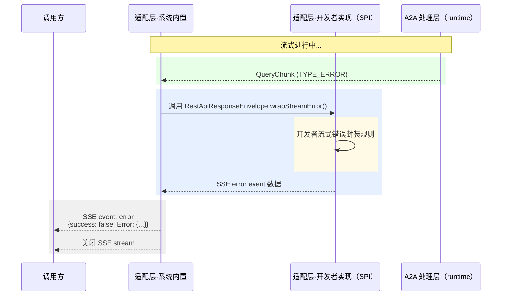

---
version：0715
module: agent-runtime
feature_type: functional
feature_id: FEAT-022
status: proposed
updated: 2026-07-09
authority:
  - README.md
  - FEAT-001-standardized-agent-service-entrypoint.md
  - FEAT-006-restful-client-facade.md
drives:
  - ../architecture/L2-Low-Level-Design/agent-runtime/FEAT-022-custom-rest-api-to-a2a-jsonrpc-adaptation-spi.md
  - ../agent-runtime/docs/guides/custom-rest-api-adaptation.md
---

# 自定义 RestAPI 到 A2A JSON-RPC 协议适配转换 SPI - 当前版本事实要求

## 1. 特性定位

FEAT-022 定义 `agent-runtime` 面向平台集成方的**自定义 REST API 协议适配 SPI**。该特性的目标是使外部网关、BFF 层或第三方平台能用其自有 REST API 格式（自定义 URI 路径、路径变量、Query 参数、Body 字段别名和响应信封）调用 Agent，而不必修改自有客户端代码去适配 A2A JSON-RPC 或 `FEAT-006` 的固定 REST facade。

本特性与 `FEAT-006` 的区别在于：`FEAT-006` 提供一组**内置固定**的 REST 端点（`/agents/{agentId}/messages` 等），而 FEAT-022 提供 **SPI 扩展点**，由客户按自身网关协议格式实现适配规则，runtime 负责将自定义 REST 请求桥接到 `FEAT-001` 定义的标准 A2A Agent 服务入口语义。

本特性是 `FEAT-001` 和 `FEAT-006` 的补充，不是替代。自定义 REST API 适配层必须复用 `FEAT-001` 的 Task、Message、SSE、Cancel、错误、租户和可观测规则，不得定义独立执行状态机。

本特性面向以下角色：

- **平台集成方**：拥有自有 REST API 协议（如GHZHY Agent 网关、企业 API 网关），需要将自有格式接入 Agent runtime 而不修改客户端。
- **网关 / BFF 开发者**：需要在网关层做协议转换，将上游自定义 REST 请求转发到 runtime 的标准 Agent 服务入口。
- **Agent 应用开发者**：通过实现 SPI 接口声明自有 REST API 路径、字段映射和响应信封格式。
- **测试与验收团队**：需要验证自定义 REST 适配不产生独立状态机，不改变标准 Agent 服务入口的事实语义。

本特性明确不面向以下路径：

- 其他 agent-runtime 调用本 runtime：必须继续以 `FEAT-001` 的 A2A Agent 服务入口为标准。
- agent-bus forwarding 投递到 runtime：必须继续落到 `FEAT-001` 的标准 Agent 服务入口。
- `FEAT-006` 已覆盖的通用 RESTful facade 场景：应由 `FEAT-006` 承接，不由本特性重复。

## 2. 本次版本能力要求

| 能力                         | 要求级别   | 本次版本变化 | 事实要求                                                                                                                                                                                                                                                                                                                                         |
| -------------------------- | ------ | ------ | -------------------------------------------------------------------------------------------------------------------------------------------------------------------------------------------------------------------------------------------------------------------------------------------------------------------------------------------- |
| SPI 接口定义                   | MUST   | 新增     | **平台**在 `agent-service-spec` 模块定义 `RestApiProtocolAdapter` 和 `RestApiResponseEnvelope` 两个 SPI 接口（含方法签名，见 §3.1），在 `agent-service-adapters` 模块提供默认实现。**开发者**实现这两个接口，声明自有 REST API 路径模式、字段映射规则和响应信封格式。                                                                                                                                          |
| 自定义路径模式注册                  | MUST   | 新增     | **平台**提供路径注册机制，允许通过 YAML 配置或代码方式声明自定义 URL 路径模式（如 `/v1/{project_id}/agents/{agent_id}/conversations/{conversation_id}`）。**开发者**配置路径模式和路径变量名。**平台**在该路径上接收 HTTP 请求，提取路径变量值后交给开发者的 `RestApiProtocolAdapter` 处理。                                                                                                                                 |
| 路径变量映射                     | MUST   | 新增     | **平台**负责从 URL 中提取路径变量值并传入方法。**开发者**在方法内编写映射逻辑。**兜底**：开发者未显式映射的路径变量，平台自动注入 `metadata[原始变量名]`。**映射什么**：将 URL 路径中的 `{变量名}` 的实际值映射到 `ServeRequest` 的直接字段或 `metadata` 子键。        |
| Query 参数映射                 | MUST   | 新增     | **平台职责**：从 HTTP 请求中提取 Query 参数并传入 `mapToServeRequest()`。**开发者职责**：在方法内编写 Query 参数名 → 目标字段的映射规则（如 `workspace_id` → `metadata.workspace_id`），映射逻辑与路径变量一致。映射规则属于开发者业务知识，平台不预置默认映射规。**映射什么**：将 URL Query 参数（如 `?workspace_id=xxx&version=2`）映射到 `ServeRequest` 直接字段或 `metadata` 子键。则。                                                             |
| Body 字段别名映射                | MUST   | 新增     | **平台职责**：解析 JSON Body 为结构化数据并传入 `mapToServeRequest()`。**开发者职责**：在方法内编写别名映射规则（如 `conversion_id` → `conversationId`、`input` → `message`、`timeout` → `metadata.timeout`）。别名映射规则属于开发者业务知识，平台不预置默认映射规则。`message` 别名（`input`、`query`）通过 `normalizeMessages()` 转为 `messages` 列表。**映射什么**：将外部 JSON Body 的字段名映射为内部 `QueryRequest` 字段名或 `metadata` 子键。 |
| 同步执行模式                     | MUST   | 现有     | 当请求 `stream=false` 或未声明流式时，**平台**以阻塞模式调用 `ServeOrchestrator.query()`，将返回的 `QueryResponse` 交给开发者的 `RestApiResponseEnvelope.wrapSuccess()` 封装为自定义信封后返回给调用方。**开发者**无需处理执行逻辑，只需实现封装规则。                                                                                                                                                           |
| 流式执行模式                     | MUST   | 现有     | 当请求 `stream=true` 时，**平台**以 SSE 模式调用 `ServeOrchestrator.streamQuery()`，将每个 `QueryChunk` 交给开发者的 `RestApiResponseEnvelope.wrapChunk()` 封装为自定义 SSE event 后推送给调用方。**开发者**只需实现流式封装规则。                                                                                                                                                             |
| 响应信封定制                     | MUST   | 新增     | **平台**调用开发者的 `RestApiResponseEnvelope` 的 `wrapSuccess()`/`wrapChunk()`/`wrapError()`/`wrapStreamError()` 方法，将 runtime 结果交给开发者封装。**开发者**自定义响应信封的字段名和字段集合（如 `success`、`agent_id`、`conversion_id`、`Output`、`Error`、`execution_time`、`custom_rsp_data`），并声明是否包含特定可选字段。                                                                           |
| 未映射字段自动注入                  | SHOULD | 新增     | Body 中未被别名映射且不属于 `QueryRequest` 直接字段的额外字段，**平台**自动注入 `ServeRequest.metadata[原始字段名]`，以便业务上下文透传。**开发者**无需手动处理这些字段。                                                                                                                                                                                                                             |
| Header 租户标识传递              | MUST   | 现有     | **平台**从 HTTP Header 中提取 `X-User-ID`、`X-Space-ID`、`X-Tenant-Id` 等执行上下文标识，作为 `ServeRequest` 的 `userId`、`spaceId`、`tenantId` 字段来源。**开发者**无需手动处理 Header 提取。                                                                                                                                                                                      |
| A2A 语义归一                   | MUST   | 现有     | 适配层的执行、状态、取消、超时、错误和可观测语义由**平台**归一到 `FEAT-001`，**开发者**不得在 SPI 实现中定义独立于 A2A 的状态机或执行链路。                                                                                                                                                                                                                                                         |
| runtime-to-runtime REST 调用 | OUT    | 不在本次范围 | 当前版本不要求其他 agent-runtime 通过自定义 REST 适配层调用本 runtime。                                                                                                                                                                                                                                                                                           |
| agent-bus REST 投递          | OUT    | 不在本次范围 | 当前版本不要求 agent-bus forwarding 通过自定义 REST 适配层投递请求。                                                                                                                                                                                                                                                                                             |
| 独立状态机                      | OUT    | 不在本次范围 | 当前版本不允许自定义适配层定义独立于 A2A Task 的 run/job/message 状态机。                                                                                                                                                                                                                                                                                           |
| webhook callback           | OUT    | 不在本次范围 | 本特性不补充 webhook 主动推送能力；非一次性响应仍使用 SSE 或 Task polling。                                                                                                                                                                                                                                                                                          |

<br />

<br />

<br />

<br />

<br />

## 3. 外部接口与入口要求

### 3.1 SPI 接口

| 接口                                 | 类型       | 事实要求                                                             |
| ---------------------------------- | -------- | ---------------------------------------------------------------- |
| `接口1`，比如 `RestApiProtocolAdapter`  | Java SPI | 必须作为客户实现的自定义 REST API 协议适配器接口。开发者实现字段映射规则。                       |
| `接口2`，比如 `RestApiResponseEnvelope` | Java SPI | 必须作为响应信封适配接口，将 `QueryResponse`、`QueryChunk`、错误和重置结果包装为客户定义的信封格式。 |
| `配置`，比如 `rest-api-adaptation.*`    | 配置属性     | 必须通过 YAML 配置绑定，承载路径模式可配置项。                                       |

**接口1 方法签名（`RestApiProtocolAdapter`）：**

```java
public interface RestApiProtocolAdapter {
    /**
     * 请求映射：接收系统从 HTTP 请求中提取的路径变量、Query 参数、Body 字段、Header，
     * 按开发者实现的映射规则转换为符合 A2A 协议的 ServeRequest。
     */
    ServeRequest mapToServeRequest(HttpServletRequest request);
}
```

**接口2 方法签名（`RestApiResponseEnvelope`）：**

```java
public interface RestApiResponseEnvelope {
    /** 同步成功响应封装：将 QueryResponse 封装为自定义信封。 */
    Map<String, Object> wrapSuccess(QueryResponse response);

    /** 流式 chunk 封装：将 QueryChunk 封装为自定义 SSE event 数据。 */
    Map<String, Object> wrapChunk(QueryChunk chunk);

    /** 非流式错误封装：将异常封装为自定义错误信封。 */
    Map<String, Object> wrapError(Throwable error);

    /** 流式错误封装：将异常封装为 SSE error event 数据。 */
    Map<String, Object> wrapStreamError(Throwable error);
}
```

### 3.2 HTTP 入口

以下入口由 SPI 配置驱动注册，路径模式由开发者定义：

| 入口                                         | 类型            | 事实要求                                                                                                                 |
| ------------------------------------------ | ------------- | -------------------------------------------------------------------------------------------------------------------- |
| `POST {queryPath}`                         | HTTP endpoint | 必须接收自定义 REST 请求体，按 SPI 映射规则适配为 `ServeRequest`，调用 `ServeOrchestrator` 执行，并按 `RestApiResponseEnvelope` 返回响应。           |
| `X-User-ID` / `X-Space-ID` / `X-Tenant-Id` | HTTP header   | 必须作为执行上下文标识来源。                                                                                                       |
| 自定义 Body                                   | JSON body     | 必须支持客户定义的外部字段名（如 `conversion_id`、`input`、`query`、`timeout`、`role_id` 等），由 SPI 别名映射转换为内部字段。                           |
| 自定义响应信封                                    | JSON body     | 必须按 SPI 声明的字段名和字段集合返回响应（如 `success`、`agent_id`、`conversion_id`、`Output`、`Error`、`execution_time`、`custom_rsp_data`）。 |

### 3.3 参考协议格式（GHZHY Agent 网关）

以下为 GHZHY Agent 网关协议作为参考实现示例，SPI 必须能承载此格式：

**URI**：`/v1/{project_id}/agents/{agent_id}/conversations/{conversation_id}`

**请求参数**：

| 参数类型     | 参数名                  | 映射目标                                        |
| -------- | -------------------- | ------------------------------------------- |
| 路径参数     | `project_id`         | `metadata.project_id`                       |
| 路径参数     | `agent_id`           | `metadata.agent_id`                         |
| 路径参数     | `conversation_id`    | `conversationId`（直接字段）                      |
| Query 参数 | `workspace_id`       | `metadata.workspace_id`                     |
| Query 参数 | `version`            | `metadata.version`                          |
| Query 参数 | `type`               | `metadata.type`                             |
| Body 参数  | `agent_id`           | `metadata.agent_id`                         |
| Body 参数  | `input`              | `message`（通过 normalizeMessages 转为 messages） |
| Body 参数  | `query`              | `message`（同 input，别名）                       |
| Body 参数  | `conversation_ended` | `metadata.conversation_ended`               |
| Body 参数  | `conversion_id`      | `conversationId`（别名，与路径变量重名时由开发者决定取值来源）     |
| Body 参数  | `stream`             | `stream`（直接字段，控制同步/流式）                      |
| Body 参数  | `timeout`            | `metadata.timeout`                          |
| Body 参数  | `role_id`            | `metadata.role_id`                          |
| Body 参数  | `role_name`          | `metadata.role_name`                        |
| Body 参数  | `custom_data`        | `metadata.custom_data`                      |

**响应参数**：

| 参数名               | 备注       |
| ----------------- | -------- |
| `success`         | 是否成功     |
| `agent_id`        | Agent 标识 |
| `conversion_id`   | 对话 ID    |
| `Output`          | 输出内容     |
| `Error`           | 错误信息     |
| `execution_time`  | 执行耗时（毫秒） |
| `custom_rsp_data` | 自定义响应数据  |

## 4. 使用方式与用户旅程

### 4.1 注册适配

开发者定义请求映射接口（`RestApiProtocolAdapter`）和响应封装接口（`RestApiResponseEnvelope`），配置适配路径，将适配器注册到系统。系统对注册进行校验，确定接口合法后适配器生效；校验失败则返回配置失败，适配器不生效。接口需同时支持流式和非流式。

| 场景                                  | 前置条件                                                             | 用户/系统动作                                                                              | 期望行为                                                                                                                                                                      |
| ----------------------------------- | ---------------------------------------------------------------- | ------------------------------------------------------------------------------------ | ------------------------------------------------------------------------------------------------------------------------------------------------------------------------- |
| 定义请求映射接口（`RestApiProtocolAdapter`）  | 开发者已创建适配器实现类                                                     | 配置适配路径模式、HTTP 方法，声明路径变量、Query 参数、Body 字段别名映射规则                                       | 开发者实现 `RestApiProtocolAdapter.mapToServeRequest()` 的字段映射规则：接收系统从 HTTP 请求中提取的路径变量、Query 参数、Body 字段、Header，将其映射为 A2A 标准 `ServeRequest` 格式后返回给 runtime；未映射字段自动注入 `metadata`。 |
| 定义响应封装接口（`RestApiResponseEnvelope`） | `RestApiProtocolAdapter` 已定义                                     | 定义 `wrapSuccess()`、`wrapChunk()`、`wrapError()`、`wrapStreamError()` 方法，配置响应信封的字段列表和顺序 | 开发者实现 `RestApiResponseEnvelope` 的响应封装规则：接收 runtime 返回的 `QueryResponse`/`QueryChunk`/错误结果，将其封装为自定义响应信封格式后返回给 runtime；异常封装为错误信封。                                            |
| 定义流式封装接口（可选）                        | `RestApiProtocolAdapter` 和 `RestApiResponseEnvelope` 已定义         | 实现 `wrapChunk()` 和 `wrapStreamError()` 方法                                            | 开发者实现 `RestApiResponseEnvelope` 的流式封装规则：接收 runtime 返回的流式 `QueryChunk`，将其封装为自定义 SSE event 后返回给 runtime；流式异常时封装为 SSE error event 并关闭流。                                      |
| 注册适配器                               | `RestApiProtocolAdapter` 和 `RestApiResponseEnvelope` 已定义，路径配置已完成 | 通过配置文件声明适配器类名，或通过代码方式注册适配器实例                                                         | 适配器实例被加载到注册表中，等待系统校验。                                                                                                                                                     |
| 系统校验适配器                             | 适配器已注册到注册表                                                       | 系统校验路径模式合法性、映射规则完整性、必填接口实现                                                           | 校验通过则适配器生效，路径模式被注册到路由表；校验失败则返回配置失败错误，适配器不生效。                                                                                                                              |

### 4.2 运行态运行

适配器已注册且校验通过后，系统按定义的路径接收 HTTP 请求，将请求数据包交给用户实现的 `RestApiProtocolAdapter`（请求映射）转换为 A2A 标准 `ServeRequest`，返回给 runtime 由其继续处理；处理完成后 runtime 将结果交给用户实现的 `RestApiResponseEnvelope`（响应封装）转换为自定义信封格式，再由系统响应给调用方。

| 场景        | 前置条件                | 用户/系统动作                                                                                                 | 期望行为                                                                                                                                                    |
| --------- | ------------------- | ------------------------------------------------------------------------------------------------------- | ------------------------------------------------------------------------------------------------------------------------------------------------------- |
| 接收非流式请求   | 适配器已注册且校验通过         | 调用方发送 POST 请求，`stream=false` 或未声明流式                                                                     | 系统按注册的路径模式接收请求，将请求数据包（路径变量、Query、Body、Header）交给 `RestApiProtocolAdapter` 进行映射。                                                                          |
| 接收流式请求    | 适配器已注册且校验通过，适配器支持流式 | 调用方发送 POST 请求，`stream=true` 或 `Accept: text/event-stream`                                               | 系统按注册的路径模式接收请求，将请求数据包交给 `RestApiProtocolAdapter` 进行映射。                                                                                                  |
| 请求映射      | 请求已接收               | 系统从 HTTP 请求中提取路径变量、Query、Body、Header，交给 `RestApiProtocolAdapter.mapToServeRequest()` 转换为 `ServeRequest` | `RestApiProtocolAdapter` 将各字段映射为 `conversationId`、`userId`、`tenantId`、`messages`、`metadata` 等，返回符合 A2A 协议的 `ServeRequest` 给 runtime；未映射字段注入 `metadata`。 |
| 请求验证      | 请求映射已完成             | runtime 验证 `ServeRequest` 中的会话 ID 和消息内容等必填字段                                                            | 验证通过则继续内部处理；验证失败则将错误交给 `RestApiResponseEnvelope.wrapError()` 封装为 400 错误信封返回。                                                                            |
| 内部处理（非流式） | 请求验证通过，非流式          | runtime 将 `ServeRequest` 交给 `ServeOrchestrator.query()`，以阻塞模式执行                                         | Agent 执行完成，返回 `QueryResponse`。                                                                                                                          |
| 内部处理（流式）  | 请求验证通过，流式           | runtime 将 `ServeRequest` 交给 `ServeOrchestrator.streamQuery()`，以流式模式执行                                   | Agent 以流式方式执行，逐个产出 `QueryChunk`。                                                                                                                        |
| 响应封装（非流式） | 内部处理完成，非流式          | runtime 将 `QueryResponse` 交给 `RestApiResponseEnvelope.wrapSuccess()`，由开发者实现的封装规则将其转换为自定义信封              | `RestApiResponseEnvelope` 将结果封装为自定义响应信封，返回给系统；系统将信封响应给调用方。                                                                                              |
| 响应封装（流式）  | 流式处理中，流式            | runtime 将每个 `QueryChunk` 交给 `RestApiResponseEnvelope.wrapChunk()`，由开发者实现的封装规则将其转换为自定义 SSE event         | `RestApiResponseEnvelope` 逐帧返回自定义 SSE event 给系统；系统逐帧推送给调用方；流结束后关闭 SSE stream。                                                                           |
| 异常封装（非流式） | 内部处理或封装过程中发生异常，非流式  | runtime 将异常交给 `RestApiResponseEnvelope.wrapError()`                                                     | `RestApiResponseEnvelope` 将异常封装为自定义错误信封，返回给系统；系统响应给调用方。                                                                                                 |
| 异常封装（流式）  | 流式过程中发生异常，流式        | runtime 将异常交给 `RestApiResponseEnvelope.wrapStreamError()`                                               | `RestApiResponseEnvelope` 将异常封装为 SSE error event 返回给系统；系统关闭 SSE stream。                                                                                 |

#### 4.2.1 同步调用流程（stream=false）



**验证失败时：**



#### 4.2.2 流式调用流程（stream=true）



**流式过程中异常时：**



## 5. 行为语义与边界

### 5.1 核心行为语义

#### 5.1.1 适配层归一语义

- 自定义 REST API 适配层是边缘适配入口，不是事实权威。
- 每个自定义 REST 调用必须映射到 `FEAT-001` 的标准 Agent 服务入口语义。
- 适配层可以改变调用形态（URL 路径、Body 字段名、响应信封格式），但不得改变 Agent 执行、Task 生命周期、取消、超时、租户、metadata 和可观测事实。
- 适配层不得绕过 `ServeOrchestrator`、`AgentReadiness`、Task 表面、trajectory、state/memory scope 等标准执行链路。

#### 5.1.2 请求适配语义

- 路径变量映射目标为 `conversationId` / `userId` / `spaceId` / `tenantId` 直接字段或 `metadata.xxx` 子键。
- 未配置映射的路径变量自动注入 `metadata[原始变量名]`。
- Query 参数映射规则与路径变量一致。
- Body 字段别名映射将外部字段名转换为内部 `QueryRequest` 字段名；`message` 别名（如 `input`、`query`）通过 `normalizeMessages()` 转为 `messages` 列表。
- Body 中未被别名映射且不属于 `QueryRequest` 直接字段的额外字段自动注入 `metadata[原始字段名]`。
- 当同一字段在多个来源（Header、路径变量、Query 参数、Body）中出现时，取值优先级由开发者在 `mapToServeRequest()` 实现中自行决定，平台不强制优先级规则。

#### 5.1.3 同步执行语义

- 当 `stream=false` 或未声明流式时，适配层调用 `ServeOrchestrator.query()` 以阻塞模式执行。
- 返回结果通过 `RestApiResponseEnvelope.wrapSuccess()` 包装为自定义信封。
- 执行时间通过 `execution_time` 字段返回（如信封配置包含此字段）。
- 阻塞等待不能无限挂起；超过执行等待窗口时，runtime 可以返回当前 Task 快照或标准错误。

#### 5.1.4 流式执行语义

- 当 `stream=true` 时，适配层调用 `ServeOrchestrator.streamQuery()` 以 SSE 模式执行。
- 每个 `QueryChunk` 通过 `RestApiResponseEnvelope.wrapChunk()` 包装为自定义信封格式，通过 SSE event 返回。
- SSE event data 为 JSON 字符串，内容为自定义信封。
- 流式连接关闭条件与标准入口一致：Task final（`observer.onComplete()`）或 interrupted（`QueryChunk(TYPE_INTERRUPT)`）状态收束当前调用流。Task 状态语义定义见 FEAT-001 §5。
- 流开始后发生异常时，应以可解析 error event 结束，而不是裸连接中断。

#### 5.1.5 响应信封语义

- 响应信封字段名和字段集合完全由 SPI 配置驱动，支持自定义。
- 默认参考字段：`success`、`agent_id`、`conversion_id`、`Output`、`Error`、`execution_time`、`custom_rsp_data`。
- 可选字段（如 `execution_time`、`custom_rsp_data`）可通过配置声明是否包含。
- 流式 chunk 信封通常不包含 `execution_time` 和 `custom_rsp_data`，但开发者可根据业务需求在 `wrapChunk()` 中自行决定是否包含。
- 错误响应信封中 `success=false`、`Output=null`、`Error` 携带错误消息。

#### 5.1.6 错误、状态与可观测结果

| 场景                               | 事实要求                                                                      |
| -------------------------------- | ------------------------------------------------------------------------- |
| 请求体非法 / JSON 解析失败                | 返回 400 HTTP status 和自定义错误信封；`Error` 表达 "request parse error"。             |
| 缺少 `conversation_id`             | 返回 400 和错误信封；`Error` 表达 "conversation\_id is required"。                   |
| 缺少 `message` / `messages`        | 返回 400 和错误信封；`Error` 表达 "messages or message is required"。                |
| handler/orchestrator 不可用         | 返回 503 和错误信封；`Error` 表达 "no agent handler configured"。                    |
| handler/runtime exception        | 返回 failed Task 投影或错误信封；`Error` 携带异常消息。                                    |
| 流式执行中异常                          | 追加一帧 SSE error event，信封 `success=false`，`Error` 携带异常消息。                   |
| tenant/correlation observability | 自定义 REST 调用必须进入与标准入口一致的 tenant/context/task/agent/correlation/trace 关联链路。 |

### 5.2 显式边界与不承诺项

| 边界                 | 当前版本不承诺                                                                           |
| ------------------ | --------------------------------------------------------------------------------- |
| 系统间标准协议替代          | 自定义 REST 适配层不替代 A2A；runtime-to-runtime 和 agent-bus forwarding 不使用自定义 REST 作为事实标准。 |
| 独立状态机              | 不定义独立 run/job/message 状态机。                                                        |
| webhook callback   | 不提供提交后主动 callback；非一次性响应使用 SSE 或 task polling。                                    |
| 多 Agent handler 路由 | 路径中的 `{agent_id}` 不意味着当前版本支持一个 runtime 内按 agent id 路由多个 handler。                  |
| 租户认证               | 适配层不认证 `X-Tenant-Id` 或 Body metadata；认证由前置网关承担。                                   |
| 非文本主路径             | 当前主路径仍是 text 输入；file/data/multipart 等输入形态需单独进入版本事实。                               |
| 强制中断底层 LLM         | `CancelTask` 不承诺能立即打断已经进入模型客户端的阻塞调用。                                              |
| 认证授权协议             | OAuth、签名校验等不在本特性事实要求中。                                                            |

## 6. 对下游设计与实现的约束

- L2 设计必须把本特性设计成 `FEAT-001` 的边缘适配层，而不是与 A2A 平级的第二协议核心。
- SPI 接口必须定义在 `agent-service-spec` 模块，默认实现放在 `agent-service-adapters` 模块，保持 Spring 类型不泄漏到 spec 层。
- 自定义 REST controller 不得绕过标准 Agent execution chain；实现必须复用或等价映射到 `ServeOrchestrator` / `AgentReadiness` / Task / error / trajectory 语义。
- 适配层的错误码、HTTP status 和 Body 字段可以面向业务 client 优化，但必须能追溯到标准错误语义。
- 适配层 SSE stream 可以提供更友好的 event 格式，但事件内容必须能还原到标准 Task/artifact/progress/terminal/error。
- 文档和示例必须明确：自定义 REST 适配层面向平台集成方；runtime-to-runtime、agent-bus forwarding、未来事件总线不以自定义 REST 适配层为标准入口。
- SPI 实现必须支持通过 YAML 配置和 Java 代码两种方式声明适配规则。
- 若未来要让自定义适配层支持 webhook、multipart、二进制文件、批量消息、独立 run resource 或多 Agent 路由，必须先更新本特性事实要求，再进入 L2 和实现。

## 7. 关联文档

- `version-scope/README.md`
- `version-scope/FEAT-001-standardized-agent-service-entrypoint.md`
- `version-scope/FEAT-006-restful-client-facade.md`
- `architecture/L2-Low-Level-Design/agent-runtime/FEAT-022-custom-rest-api-to-a2a-jsonrpc-adaptation-spi.md`
- `agent-runtime/docs/guides/custom-rest-api-adaptation.md`


